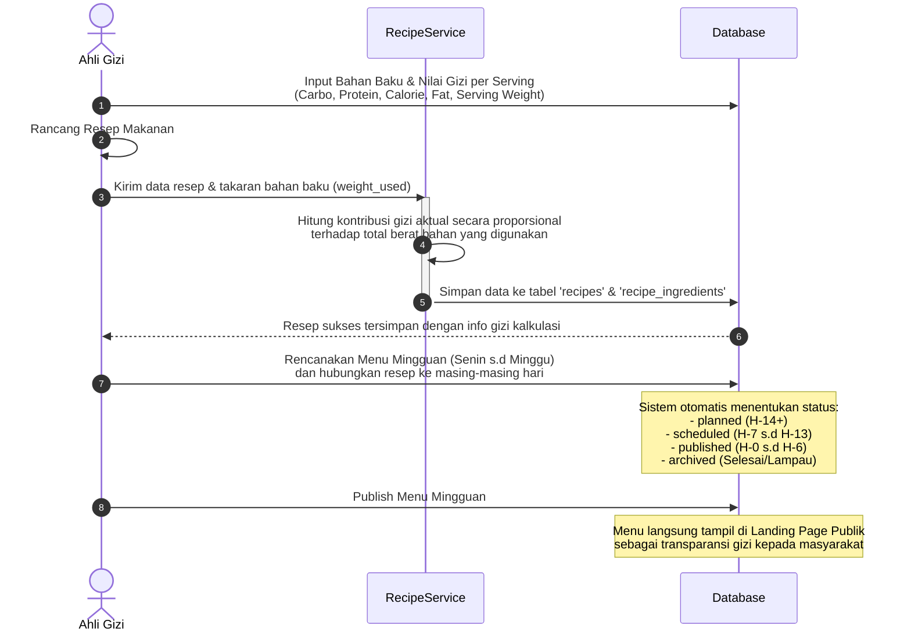
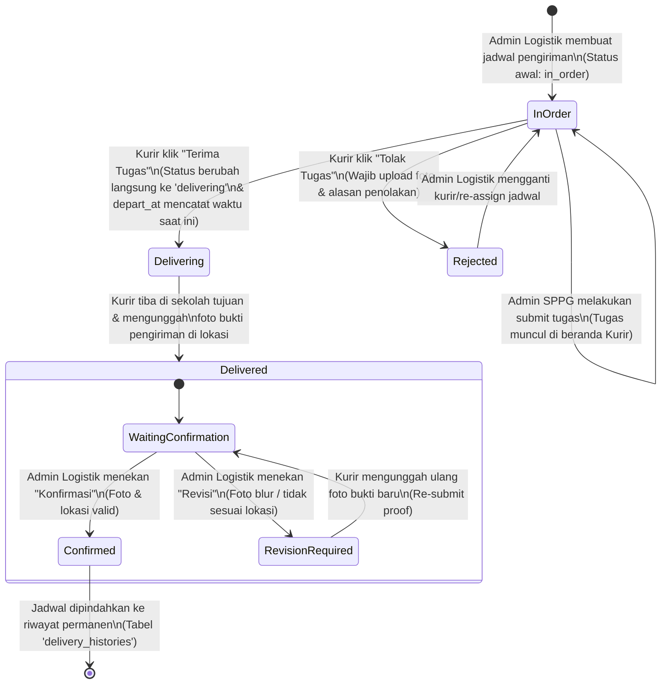

# 🔄 ALUR SISTEM DAN ALIRAN KERJA — COMS MBG

Dokumen ini menjelaskan alur kerja (*workflow*), proses bisnis, serta integrasi antar aktor di dalam sistem **COMS MBG (Coffee Management System — Makan Bergizi Gratis)**. Sistem ini dirancang untuk mengotomatisasi seluruh rantai pasok makanan bergizi gratis, mulai dari pendaftaran unit produksi (SPPG), penyusunan resep dan menu, manajemen mitra (*partners*), hingga pengiriman makanan dan pemantauan kurir secara *real-time*.

---

## 📌 Daftar Aktor & Peran (Actors & Roles)

Sistem COMS MBG mengadopsi sistem **RBAC (Role-Based Access Control)** yang membagi wewenang ke dalam beberapa peran utama:

| Aktor | Cakupan Akses | Tanggung Jawab Utama |
|---|---|---|
| **Super Admin** | Seluruh SPPG & Sistem | Pendaftaran SPPG baru, alokasi sekolah ke SPPG, monitoring global. |
| **Pemilik (Owner)** | 1 SPPG Terkait | Akses penuh operasional SPPG miliknya, laporan keuangan, dan HR. |
| **Admin SPPG** | 1 SPPG Terkait | Manajemen harian: Karyawan, Role/Permission, Mitra Sekolah, dsb. |
| **Ahli Gizi (Nutritionist)**| 1 SPPG Terkait | Mengelola Bahan Baku (*Ingredients*), Resep (*Recipes*), dan Menu Mingguan (*Menus*). |
| **Admin Logistik** | 1 SPPG Terkait | Pembuatan jadwal pengiriman, penugasan kurir, monitoring GIS, konfirmasi pengiriman. |
| **Kurir (Courier)** | Aplikasi / Endpoint Kurir | Menerima/menolak tugas, melakukan pengiriman, mengirimkan koordinat GPS aktif, unggah bukti. |
| **Manajer (Manager)** | 1 SPPG Terkait | Monitoring umum, melihat menu, membaca laporan keuangan & distribusi. |
| **Publik (Tanpa Login)** | Landing Page | Melihat menu mingguan, rating/feedback, pencarian SPPG terdekat, pengajuan SPPG baru. |

---

## 🗺️ Gambaran Umum Alur End-to-End

Berikut adalah visualisasi alur harian dan siklus kerja utama di dalam COMS MBG:

```mermaid
graph TD
    %% Setup Awal oleh Super Admin
    subgraph 1. Fase Inisialisasi & Setup (Super Admin)
        A1[Pengajuan SPPG Baru oleh Publik] -->|Disetujui Super Admin| A2[Pendaftaran SPPG di Sistem]
        A2 --> A3[Pendaftaran Sekolah Penerima & Assign ke SPPG]
    end

    %% Manajemen Internal oleh Admin SPPG
    subgraph 2. Fase Manajemen SPPG (Admin SPPG & Pemilik)
        A3 --> B1[Tambah Karyawan & Assign Akun]
        B1 --> B2[Assign Role & Permission Karyawan]
        B2 --> B3[Import/Kelola Mitra Sekolah / Partners]
    end

    %% Perencanaan Menu oleh Ahli Gizi
    subgraph 3. Perencanaan & Nutrisi (Ahli Gizi)
        B3 --> C1[Input Bahan Baku & Kandungan Gizi]
        C1 --> C2[Buat Resep Makanan & Kontribusi Gizi Otomatis]
        C2 --> C3[Buat Rencana Menu Mingguan]
        C3 --> C4[Publish Menu ke Halaman Publik]
    end

    %% Pengiriman oleh Logistik & Kurir
    subgraph 4. Distribusi & Pelacakan GIS (Logistik & Kurir)
        C4 --> D1[Buat Jadwal Pengiriman & Pilih Kurir/Kendaraan]
        D1 --> D2[Submit Jadwal ke Kurir]
        D2 -->|Kurir Setuju| D3[Kurir Berangkat & Kirim GPS Real-Time]
        D2 -->|Kurir Tolak| D1
        D3 --> D4[Kurir Tiba & Upload Foto Bukti Pengiriman]
        D4 -->|Dikonfirmasi Admin Logistik| D5[Selesai & Masuk Riwayat Permanen]
        D4 -->|Revisi Bukti oleh Admin| D4
    end

    %% Feedback dari Publik/Siswa
    subgraph 5. Evaluasi & Feedback (Publik & Siswa)
        D5 --> E1[Siswa/Wali Murid Melihat Menu & Beri Rating/Feedback]
        E1 --> E2[Analisis Laporan Keuangan & Evaluasi Kinerja]
    end

    style 1. Fase Inisialisasi & Setup (Super Admin) fill:#f5f7fa,stroke:#cbd5e1,stroke-width:2px;
    style 2. Fase Manajemen SPPG (Admin SPPG & Pemilik) fill:#e0f2fe,stroke:#7dd3fc,stroke-width:2px;
    style 3. Perencanaan & Nutrisi (Ahli Gizi) fill:#f0fdf4,stroke:#86efac,stroke-width:2px;
    style 4. Distribusi & Pelacakan GIS (Logistik & Kurir) fill:#fff7ed,stroke:#fdba74,stroke-width:2px;
    style 5. Evaluasi & Feedback (Publik & Siswa) fill:#faf5ff,stroke:#d8b4fe,stroke-width:2px;
```

---

## 1. Alur Pendaftaran SPPG & Inisialisasi Sistem (Super Admin)

Fase ini merupakan langkah awal sebelum sistem operasional dapat digunakan oleh masing-masing unit dapur (SPPG).

```
[Publik / Calon Pemilik]                    [Super Admin]                    [Database]
          │                                       │                              │
          │ 1. Kirim Pengajuan SPPG Baru          │                              │
          ├──────────────────────────────────────▶│                              │
          │    (Formulir, Berkas, Koordinat)      │                              │
          │                                       │ 2. Verifikasi Kelayakan      │
          │                                       ├──────────────┐               │
          │                                       │              │               │
          │                                       │◀─────────────┘               │
          │                                       │                              │
          │                                       │ 3. Buat Record SPPG & Owner  │
          │                                       ├─────────────────────────────▶│
          │                                       │                              │ Simpan ke tabel:
          │                                       │                              │ - s_p_p_g_s
          │                                       │                              │ - users (Pemilik)
          │                                       │◀─────────────────────────────┤
          │ 4. Akun Pemilik & SPPG Aktif          │                              │
          │◀──────────────────────────────────────┤                              │
```

### Langkah Kerja Detail:
1. **Pengajuan Publik:** Calon pemilik mengirimkan pengajuan pembukaan SPPG melalui endpoint publik `/api/public/sppg-submissions`.
2. **Verifikasi & Pembuatan:** Super Admin memverifikasi pengajuan tersebut. Jika disetujui, Super Admin mendaftarkan SPPG baru lewat `/api/super-admin/sppg` dan otomatis membuat akun untuk Pemilik (*Owner*) SPPG tersebut.
3. **Alokasi Sekolah:** Super Admin memetakan sekolah penerima program (`schools`) yang berada dalam jangkauan kapasitas SPPG menggunakan endpoint `/api/super-admin/sppg/{id}/assign-school`. Jarak dihitung otomatis menggunakan formula Haversine untuk efisiensi jarak tempuh.

---

## 2. Alur Manajemen Karyawan & Mitra (Admin SPPG)

Setelah unit SPPG aktif, Admin SPPG atau Pemilik mengambil alih kendali untuk mengatur operasional internal dan data mitra sekolah.

```
                  ┌──────────────────────────────────────────────┐
                  │          Admin SPPG Mulai Setup              │
                  └──────────────────────┬───────────────────────┘
                                         │
                                         ▼
                     ┌───────────────────────────────────────┐
                     │ Pendaftaran Karyawan baru di SPPG     │
                     │ (NIK, Posisi: Kurir, Ahli Gizi, dll)  │
                     └───────────────────┬───────────────────┘
                                         │
                                         ▼
                     ┌───────────────────────────────────────┐
                     │   Apakah Butuh Akses ke Sistem API?   │
                     └───────────────────┬───────────────────┘
                                         │
                        ┌────────────────┴────────────────┐
                     Tidak                               Ya
                        │                                 │
                        ▼                                 ▼
         ┌─────────────────────────────┐   ┌─────────────────────────────┐
         │ Simpan sebagai karyawan     │   │ 1. Buat User Account        │
         │ operasional non-sistem      │   │ 2. Set employee.user_id     │
         │ (Contoh: Juru masak)        │   │ 3. Assign Role & Permissions │
         └─────────────────────────────┘   └──────────────┬──────────────┘
                                                          │
                                                          ▼
                                           ┌─────────────────────────────┐
                                           │  Karyawan bisa Login sesuai │
                                           │  perannya (Ahli Gizi/Kurir) │
                                           └─────────────────────────────┘
```

### Alur Sinkronisasi Akun & Role:
- **Karyawan Tanpa Akun:** Beberapa karyawan (seperti juru masak atau tenaga cuci) hanya dicatat datanya di sistem untuk keperluan penggajian/operasional dapur (`employees` table).
- **Karyawan Dengan Akun:** Karyawan yang membutuhkan akses ke aplikasi/sistem (seperti Ahli Gizi, Admin Logistik, dan Kurir) dibuatkan akun user (`users` table). Kolom `employees.user_id` dihubungkan ke `users.id`, dan `employees.role_id` dihubungkan ke `roles.id`. Karyawan tersebut langsung mewarisi permission yang menempel pada role tersebut.

### Pengelolaan Mitra (*Partners*):
Admin SPPG juga bertugas mengelola data sekolah mitra (*Partners*). 
> **Catatan Teknis (Bahasa Inggris):** Seluruh kolom database untuk modul Partner menggunakan format bahasa Inggris standar:
> - `school_name` (Nama Sekolah)
> - `npsn` (Nomor Pokok Sekolah Nasional)
> - `school_type` (Tingkat: SD/SMP/SMA/dll)
> - `ownership_status` (Status: `public` untuk Negeri, `private` untuk Swasta)
> - `address` (Alamat)
> - `district` (Kecamatan)
> - `city` (Kabupaten/Kota)
> - `portion_count` (Jumlah porsi makanan yang dialokasikan)

Admin SPPG dapat mengunggah file CSV secara massal melalui endpoint `/api/admin-sppg/partners/import`. Sistem memiliki fitur **backward-compatibility** yang otomatis mendeteksi header berbahasa Indonesia dan mengonversi status "Negeri/Swasta" menjadi "public/private" secara transparan.

---

## 3. Alur Perencanaan Nutrisi & Menu Mingguan (Ahli Gizi)

Ahli Gizi bertanggung jawab memastikan makanan yang dimasak memenuhi standar gizi mingguan (Kalori, Karbohidrat, Protein, dan Lemak).



---

## 4. Alur Kerja Distribusi & Pelacakan GIS Real-Time (Logistik & Kurir)

Modul distribusi adalah bagian paling dinamis dari sistem COMS MBG, melibatkan pelacakan koordinat GPS real-time dan transisi status pengiriman yang ketat.



### Penjelasan Detil Fase Distribusi:

1. **Pembuatan Jadwal (`in_order`):** Admin Logistik memilih sekolah tujuan (`school_id`), kurir yang bertugas (`courier_id`), jenis kendaraan, nomor plat, serta waktu keberangkatan.
2. **Submit Tugas Kurir:** Admin SPPG men-submit tugas tersebut. Status tetap `in_order`, namun `submitted_by` terisi dan tugas muncul di aplikasi kurir yang bersangkutan.
3. **Konfirmasi Kurir:** Setelah tugas disubmit, kurir dapat:
   - **Menerima Tugas (`delivering`):** Kurir menekan "Terima Tugas". Status di database **langsung berubah dari `in_order` ke `delivering`** (dalam perjalanan), serta mencatat waktu berangkat secara otomatis pada kolom `departed_at`. GPS tracking di perangkat kurir mulai aktif melakukan *ping*.
   - **Menolak Tugas (`rejected`):** Kurir menolak tugas dengan memberikan alasan penolakan dan mengunggah foto pendukung. Status diubah ke `rejected` dan waktu penolakan dicatat pada `rejected_at`. Jadwal ini kemudian dialihkan kembali ke status `in_order` oleh Admin Logistik untuk ditugaskan ke kurir lain.
4. **Mulai Pengantaran & Pelacakan GIS (`delivering`):** 
   - Selama perjalanan, perangkat kurir mengirimkan koordinat GPS secara berkala ke endpoint `/api/distribution/map/location/{id}`.
   - Koordinat disimpan di tabel `courier_locations` tanpa kolom `created_at`/`updated_at` bawaan Laravel demi efisiensi tinggi pada penulisan database berfrekuensi tinggi (*high-frequency writes*).
   - Admin Logistik dan masyarakat umum dapat memantau perjalanan kurir secara visual di peta melalui monitoring GIS.
5. **Tiba di Lokasi (`delivered`):** Kurir tiba di sekolah tujuan (diverifikasi melalui geofencing radius lokasi sekolah), mengambil foto serah terima makanan, lalu mengunggahnya. Status berubah menjadi `delivered`.
6. **Konfirmasi Akhir (`confirmed`):** 
   - Admin Logistik meneliti foto bukti pengiriman.
   - Jika valid, status diubah menjadi `confirmed`.
   - Seluruh data pengiriman, jejak rute (`route_snapshot`), dan metrik jarak dibekukan secara permanen ke dalam tabel `delivery_histories` sebagai *immutable log* (catatan sejarah yang tidak boleh diubah untuk audit transparansi).
   - Jika bukti buruk, admin meminta `revision_required`, memaksa kurir untuk mengunggah ulang foto serah terima yang benar.

---

## 5. Alur Feedback & Evaluasi Publik (Transparansi)

Sistem ini didesain transparan untuk menghindari adanya penyelewengan dalam penyaluran makanan gratis.

```
  [Masyarakat / Siswa / Wali]               [Landing Page API]                  [Database / Admin]
               │                                      │                                  │
               │ 1. Buka Halaman Dashboard Publik     │                                  │
               ├─────────────────────────────────────▶│                                  │
               │                                      │ 2. Ambil data menu aktif         │
               │                                      ├─────────────────────────────────▶│
               │ 3. Tampilkan Menu Mingguan           │                                  │
               │    dan Data Kandungan Nutrisi        │                                  │
               │◀─────────────────────────────────────┤                                  │
               │                                      │                                  │
               │ 4. Kirim Umpan Balik (Feedback) &    │                                  │
               │    Rating Kepuasan Makanan           │                                  │
               ├─────────────────────────────────────▶│                                  │
               │                                      │ 5. Simpan Rating & Feedback      │
               │                                      ├─────────────────────────────────▶│
               │                                      │                                  │ Disimpan ke tabel:
               │                                      │                                  │ - feedback
               │                                      │                                  │ - ratings
               │                                      │◀─────────────────────────────────┤
               │ 6. Umpan Balik Sukses Terkirim       │                                  │
               │◀─────────────────────────────────────┤                                  │
               │                                                                         │ 7. Laporan Dievaluasi
               │                                                                         │    oleh Pemilik/Manajer
```

### Manfaat Alur Evaluasi:
- **Transparansi Gizi:** Menu harian yang dimasak oleh dapur SPPG dapat langsung dicocokkan oleh wali murid di rumah melalui visualisasi nilai gizi di landing page.
- **Saluran Kritik & Saran:** Masyarakat dapat langsung mengirimkan keluhan (misal: rasa makanan, porsi kurang, keterlambatan) yang langsung masuk ke dasbor Pemilik SPPG sebagai bahan evaluasi internal.

---

## 🔒 Ringkasan Alur Keamanan Request

Setiap kali API COMS MBG menerima request, Laravel Middleware bertindak sebagai satpam berlapis untuk menjamin integritas data:

```
[ Masuk: Request API ]
         │
         ▼
[ 🛡️ Middleware: auth:sanctum ] 
Apakah cookie session / token valid?
  ├── ❌ Tidak ──▶ [ Response: 401 Unauthenticated ]
  └── ✅ Ya
         │
         ▼
[ 🛡️ Middleware: CheckRole ]
Apakah aktor memiliki Role yang diperbolehkan di rute ini?
(Super Admin langsung lolos/bypass otomatis)
  ├── ❌ Tidak ──▶ [ Response: 403 Forbidden - Role Tidak Sesuai ]
  └── ✅ Ya
         │
         ▼
[ 🛡️ Middleware: CheckPermission ]
Apakah Role tersebut memiliki Permission spesifik untuk aksi ini?
(Contoh: 'ingredients.create', 'partner.delete')
  ├── ❌ Tidak ──▶ [ Response: 403 Forbidden - Permission Tidak Cukup ]
  └── ✅ Ya
         │
         ▼
[ 🛡️ Middleware: ScopeBySppg ]
Apakah data yang diminta milik SPPG aktor itu sendiri?
(Mencegah Admin SPPG A melihat data SPPG B)
  ├── ❌ Tidak ──▶ [ Response: 403 Forbidden - Akses SPPG Ditolak ]
  └── ✅ Ya
         │
         ▼
[ 🎬 Controller Action Terpanggil ] ──▶ Operasi Database & Kembalikan Data JSON
```

---
*Dokumen Alur Sistem ini disesuaikan dengan kode sumber COMS MBG terbaru.*  
*Pembaruan terakhir: Juni 2026.*
