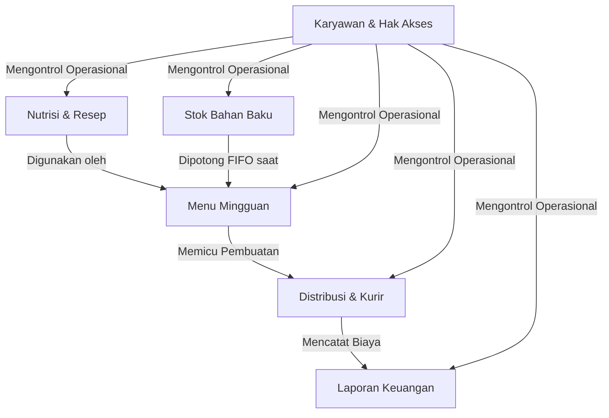
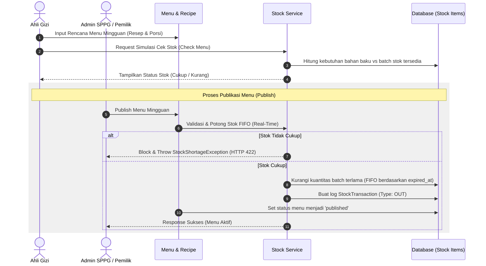
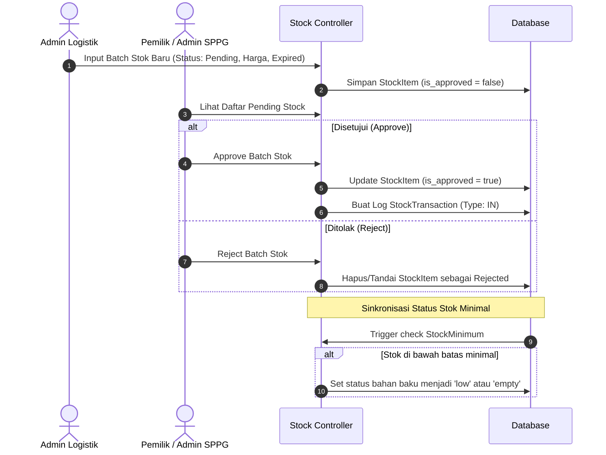
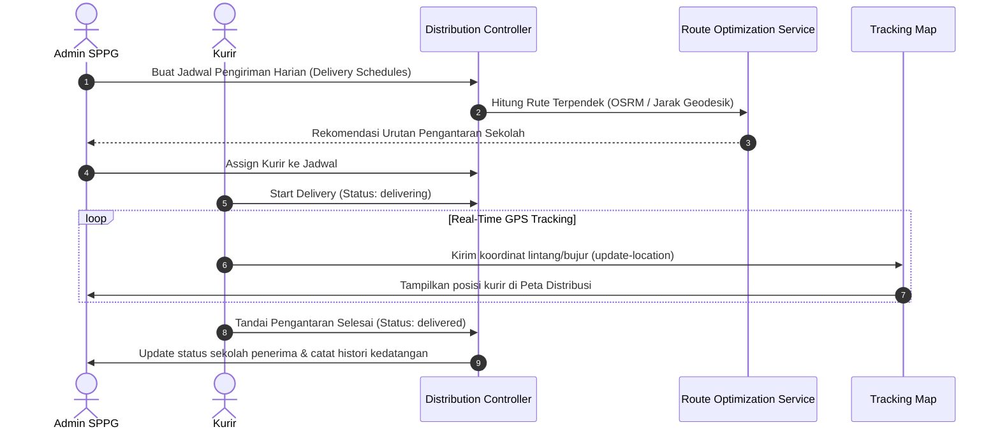
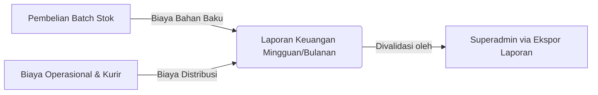

# Alur Rangkaian Sistem Admin SPPG

Dokumen ini menjelaskan seluruh rangkaian alur sistem untuk **Admin SPPG (Satuan Pelayanan Program Gizi)** berdasarkan implementasi terbaru dalam codebase COMS-MBG.

---

## 1. Ikhtisar Arsitektur Admin SPPG

Modul Admin SPPG didesain untuk melayani operasional harian pada level lokal SPPG (dapur produksi gizi). Sistem ini terbagi menjadi 5 pilar utama yang saling terintegrasi:

---

## 2. Rangkaian Alur Operasional Utama

### Flow A: Perencanaan Menu Mingguan & Pemotongan Stok FIFO

Alur ini menghubungkan perencanaan gizi oleh Ahli Gizi dengan inventori fisik bahan baku oleh Admin Logistik.

#### Rincian Teknis Flow A:
1. **Penyusunan Resep**: Resep (`recipes`) mendefinisikan daftar bahan baku (`ingredients`) beserta berat/porsi dalam gram.
2. **Cek Ketersediaan**: Saat simulasi/publikasi, sistem mengalikan kebutuhan bahan baku per porsi dengan jumlah porsi sekolah mitra yang dilayani oleh SPPG tersebut.
3. **Aturan FIFO**: Pemotongan stok memprioritaskan batch `stock_items` yang memiliki tanggal kadaluwarsa (`expired_at`) paling awal.
4. **Log Mutasi**: Setiap pengurangan stok mencatat transaksi bertipe `OUT` pada tabel `stock_transactions` secara immutable.

---

### Flow B: Pengadaan Stok (Procurement) & Level Batas Minimal

Alur untuk menambah ketersediaan bahan baku di SPPG melalui mekanisme persetujuan (*approval*).

#### Rincian Teknis Flow B:
1. **Keamanan Data**: Batch stok baru tidak langsung memengaruhi ketersediaan untuk menu sebelum disetujui (`is_approved = true`).
2. **Stock Minimum**: Setiap SPPG dapat mengatur batas minimal stok bahan baku secara mandiri (`stock_minimum`). Jika total kuantitas bahan gizi yang *approved* berada di bawah batas ini, sistem akan memberikan tanda peringatan.

---

### Flow C: Pengiriman Makanan (Distribusi) & Pelacakan Kurir

Alur pengantaran makanan sehat dari dapur SPPG ke sekolah mitra menggunakan perutean yang dioptimalkan.

#### Rincian Teknis Flow C:
1. **Route Optimization**: Sistem menyusun urutan sekolah yang harus dikunjungi oleh kurir agar menghemat waktu tempuh dan jarak.
2. **Geofencing/Tracking**: Lokasi kurir disimpan secara berkala ke tabel `courier_locations` untuk pelaporan jejak perjalanan (*courier trail*).

---

### Flow D: Laporan Keuangan (Financial Reporting)

Alur pertanggungjawaban anggaran biaya operasional SPPG.

---

## 3. Struktur Endpoint API Admin SPPG

Seluruh endpoint di bawah berada di bawah prefix `/api/admin-sppg` dengan proteksi token Sanctum serta verifikasi otorisasi permission:

| Modul | Method | Path | Keterangan |
| :--- | :--- | :--- | :--- |
| **Dashboard** | `GET` | `/dashboard` | Menampilkan ringkasan jadwal pengiriman, status kurir, dan biaya bulan ini. |
| **Karyawan** | `GET` / `POST` | `/employees` | CRUD data staf internal SPPG. |
| | `POST` | `/employees/{id}/assign-role` | Menetapkan hak akses peran staf. |
| **Mitra & Sekolah** | `GET` / `POST` | `/partners` | CRUD sekolah mitra yang dilayani oleh SPPG ini. |
| | `POST` | `/partners/import` | Impor data sekolah dalam format file. |
| **Gizi & Menu** | `GET` / `POST` | `/nutrition/ingredients` | CRUD data bahan baku masakan beserta info gizinya. |
| | `GET` / `POST` | `/nutrition/recipes` | CRUD resep makanan (komposisi bahan baku). |
| | `GET` / `POST` | `/nutrition/menus` | CRUD menu mingguan. |
| | `PATCH` | `/nutrition/menus/{id}/publish` | **Mempublikasikan menu + potong stok FIFO**. |
| **Stok** | `GET` / `POST` | `/stocks` | CRUD batch persediaan stok bahan baku. |
| | `GET` | `/stocks/pending` | Listing batch pengadaan yang menunggu approval. |
| | `POST` | `/stocks/{id}/approve` | Menyetujui batch stok masuk (menambah saldo stok). |
| | `GET` | `/stocks/check-menu/{menu_id}` | Simulasi kecukupan stok sebelum publikasi menu. |
| **Distribusi** | `GET` / `POST` | `/distributions` | Mengelola jadwal & penugasan pengiriman makanan. |
| | `POST` | `/tracking/update-location` | Endpoint bagi kurir untuk mengirim data GPS saat bertugas. |
| | `GET` | `/maps/distribution` | Layer peta sebaran pengiriman aktif. |
| **Laporan** | `GET` / `POST` | `/financial-reports` | CRUD pembukuan laporan keuangan bulanan. |
