# 🏛️ COMS-MBG — Alur Lengkap SuperAdmin

> Dokumen ini menjelaskan **semua hal yang terjadi di sisi sistem** ketika SuperAdmin menggunakan aplikasi COMS-MBG — ditulis agar mudah dipahami oleh siapapun, tanpa perlu mengerti kode.

---

## 🗺️ Gambaran Besar — Apa Saja Yang Bisa Dilakukan SuperAdmin?

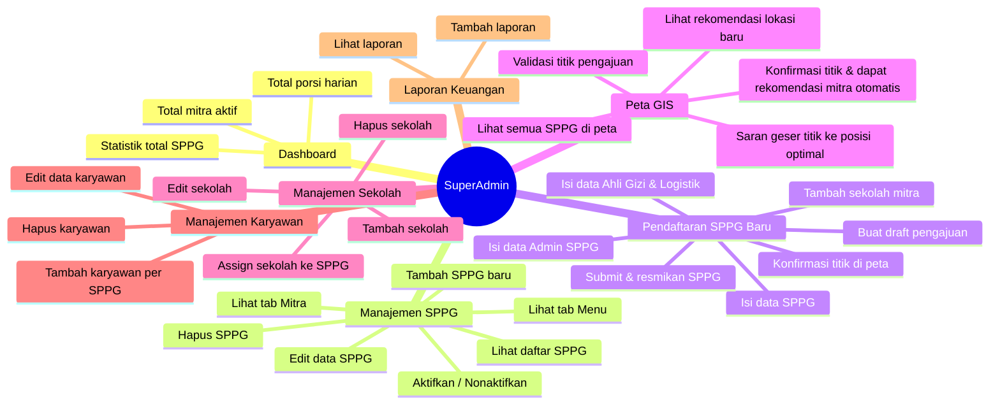

---

## 1️⃣ Dashboard — Halaman Utama

Saat SuperAdmin membuka aplikasi, halaman pertama yang muncul adalah **Dashboard**. Sistem secara otomatis menghitung dan menampilkan angka-angka terkini.

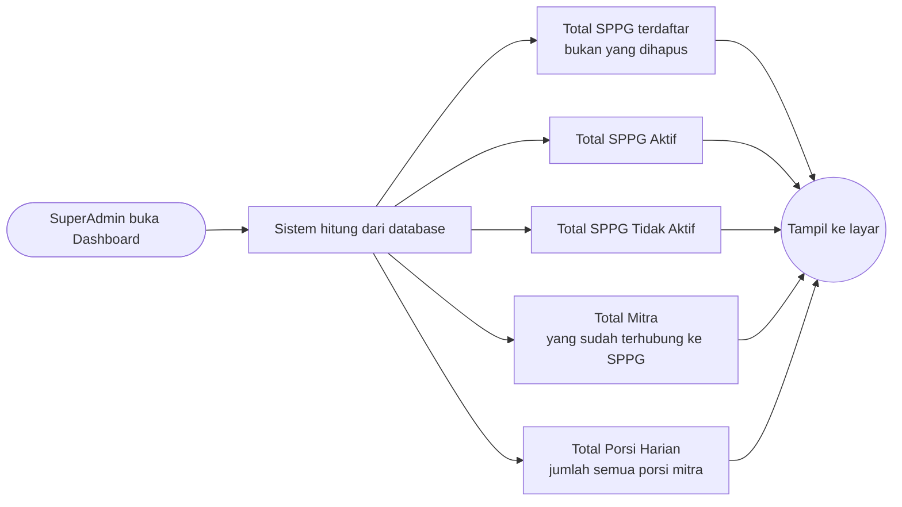

> **Catatan:** Angka di dashboard bersifat **real-time** — langsung dari database saat halaman dibuka.

---

## 2️⃣ Manajemen SPPG — Pusat Kendali Dapur Produksi

### 2a. Melihat Daftar SPPG

SuperAdmin bisa mencari dan memfilter SPPG yang sudah terdaftar.

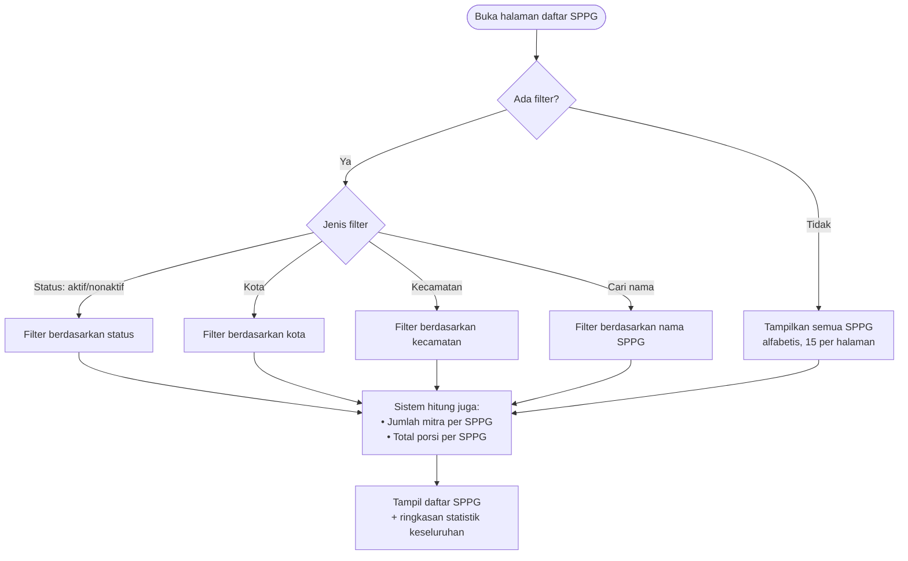

**Statistik ringkasan** yang muncul di atas tabel:
| Angka | Keterangan |
|---|---|
| Total | Semua SPPG yang pernah didaftarkan |
| Aktif | SPPG yang sedang beroperasi |
| Tidak Aktif | SPPG yang sementara dinonaktifkan |
| Pending | SPPG yang baru didaftarkan, belum aktif |
| Overcapacity | SPPG yang jumlah sekolahnya melebihi kapasitas |

---

### 2b. Melihat Detail SPPG

Klik satu SPPG → muncul halaman detail dengan **3 tab**: Info, Mitra, Menu.

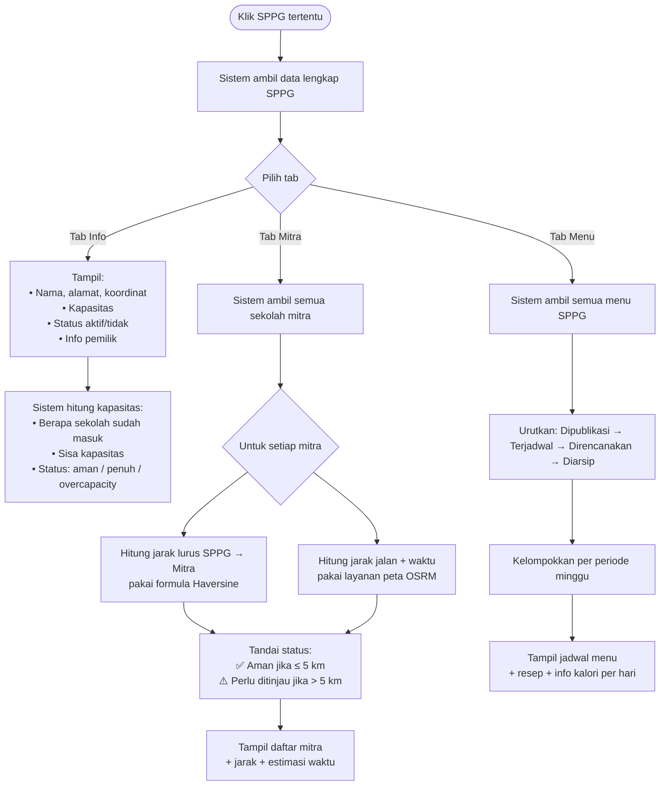

---

### 2c. Mengaktifkan / Menonaktifkan SPPG

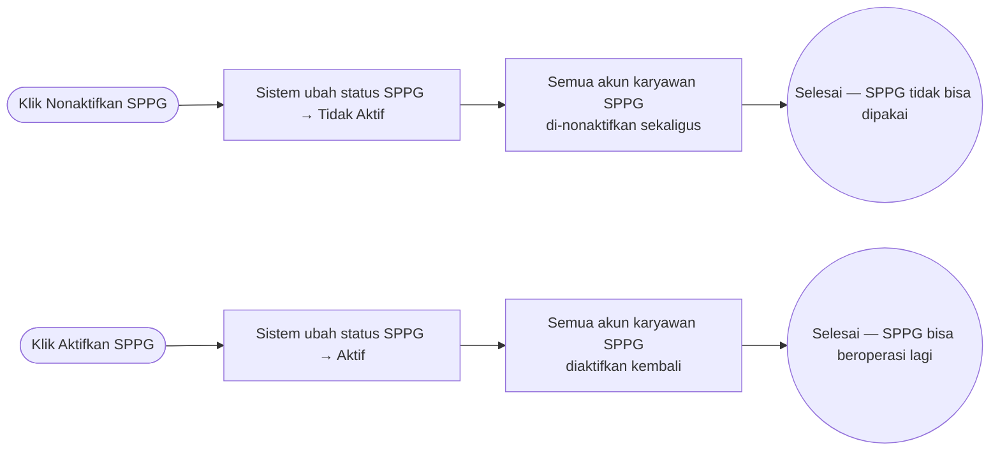

> ⚠️ **Saat SPPG dinonaktifkan, SEMUA karyawannya otomatis tidak bisa login.** Saat diaktifkan kembali, semua akun karyawan aktif juga kembali.

---

### 2d. Menghapus SPPG

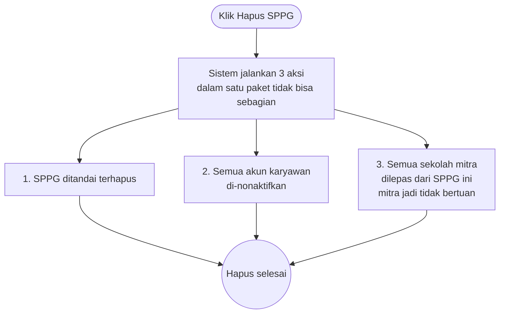

> ⚠️ **Menghapus SPPG tidak menghapus data sekolah mitra.** Sekolah hanya dilepas — bisa ditambahkan ke SPPG lain nantinya.

---

## 3️⃣ Pendaftaran SPPG Baru — Alur Multi-Langkah

Ini adalah fitur **paling kompleks** di SuperAdmin. Ada dua jalur:
- **Jalur Internal** — SuperAdmin sendiri yang buat draft
- **Jalur Pengajuan Masuk** — User biasa ajukan, SuperAdmin yang proses

### Gambaran Besar Alur Pendaftaran

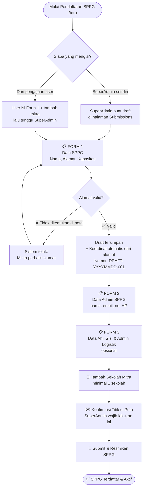

---

### 3a. Detail: Validasi Alamat Saat Isi Form 1

Saat pengguna mengetik alamat, sistem memvalidasinya secara otomatis ke layanan peta OpenStreetMap.

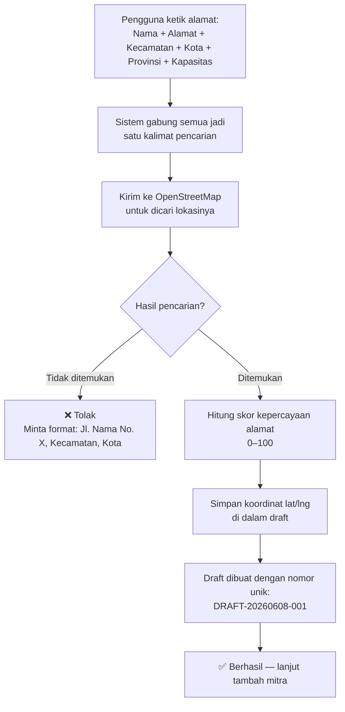

---

### 3b. Detail: Tambah Sekolah Mitra ke Draft

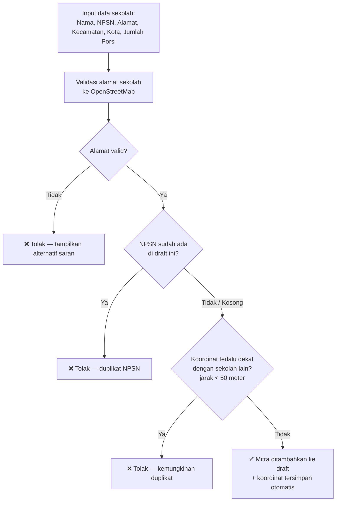

---

### 3c. Detail: Konfirmasi Titik di Peta — Langkah Kritis

Ini adalah langkah **paling penting** sebelum submit. SuperAdmin memilih/menggeser titik SPPG di peta, lalu klik "Konfirmasi".

```mermaid
flowchart TD
    A([SuperAdmin klik Konfirmasi Titik\ndi koordinat tertentu]) --> B

    B[LANGKAH 1: Validasi Titik\nApakah lokasi ini aman?] --> B1{Cek: ada SPPG aktif\nlain dalam radius 5 km?}
    B1 -- Ada & masih bisa tampung --> B2[🔴 MERAH: Konflik!\nLokasi terlalu dekat dengan SPPG lain\nyang masih memiliki kapasitas]
    B1 -- Ada tapi overcapacity --> B3[🟡 KUNING: Perhatian\nAda SPPG di dekat sini\ntapi sudah penuh]
    B1 -- Tidak ada --> B4[🟢 HIJAU: Aman\nTidak ada konflik lokasi]

    B2 & B3 & B4 --> C

    C[LANGKAH 2: Reverse Geocoding\nKoordinat → Alamat lengkap] --> C1[Sistem kirim koordinat ke OpenStreetMap]
    C1 --> C2[Dapat alamat otomatis:\nJalan, Kecamatan, Kota, Provinsi]
    C2 --> C3[Update otomatis data Form 1\nalamat SPPG diisi dari hasil ini]

    C3 --> D

    D[LANGKAH 3: Simpan ke Draft] --> D1[Simpan koordinat yang dikonfirmasi]
    D1 --> D2[Simpan status titik: hijau/kuning/merah]
    D2 --> D3[Tandai: map_confirmed = true\nSudah dikonfirmasi oleh SuperAdmin]

    D3 --> E

    E[LANGKAH 4: Cek Mitra Pengajuan yang Sudah Ada] --> E1{Untuk setiap mitra\nyang sudah ditambahkan}
    E1 --> E2[Hitung jarak & waktu tempuh\nke mitra tersebut via OSRM]
    E2 --> E3{Jarak > 5 km\natau waktu > 30 menit?}
    E3 -- Ya --> E4[⚠️ Tandai mitra: OUT OF RANGE\nSuperAdmin perlu tinjau ulang]
    E3 -- Tidak --> E5[✅ Mitra dalam jangkauan normal]
    E4 & E5 --> F

    F[LANGKAH 5: Rekomendasi Mitra Otomatis] --> F1[Cari semua sekolah\nyang BELUM punya SPPG\ndalam radius 5 km & 30 menit]
    F1 --> F2[Urutkan dari yang paling dekat]
    F2 --> F3{Data porsi tersedia?}
    F3 -- Ya --> F4[Pilih mitra sampai\ntotal porsi mencapai kapasitas SPPG]
    F3 -- Tidak --> F5[Ambil maksimal 4 sekolah terdekat]
    F4 & F5 --> F6

    F6{Sudah ada di daftar mitra\ndraft ini? cek NPSN & jarak}
    F6 -- Duplikat → skip --> F7[Abaikan]
    F6 -- Baru → tambahkan --> F8[✅ Tambahkan ke daftar mitra\ndengan label: Rekomendasi Sistem]

    F7 & F8 --> G

    G([Selesai! Laporan dikirim ke layar:\n• Status titik\n• Alamat yang diupdate\n• Jumlah mitra baru ditambahkan\n• Mitra yang out of range])
```

---

### 3d. Cek Sebelum Submit — Sistem Tolak Jika Tidak Lengkap

Saat SuperAdmin klik **Submit**, sistem menjalankan **4 pemeriksaan wajib** sebelum SPPG resmi terdaftar.

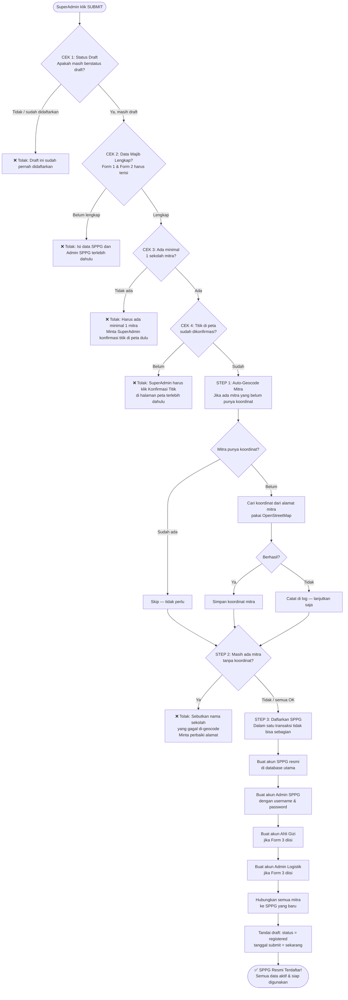

---

## 4️⃣ Peta GIS — Melihat Gambaran di Peta

Halaman peta memungkinkan SuperAdmin melihat kondisi semua SPPG dan sekolah secara visual.

### 4a. Data Yang Muncul di Peta

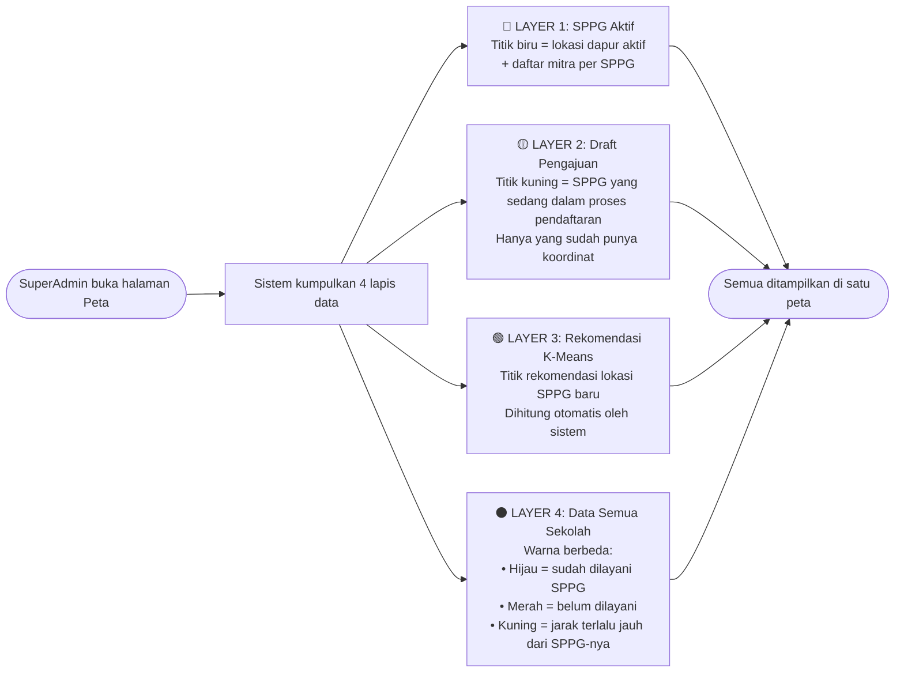

---

### 4b. Bagaimana Rekomendasi Lokasi SPPG Baru Dihitung? (K-Means)

Sistem secara cerdas menghitung di mana sebaiknya SPPG baru dibangun, berdasarkan posisi sekolah yang belum terlayani.

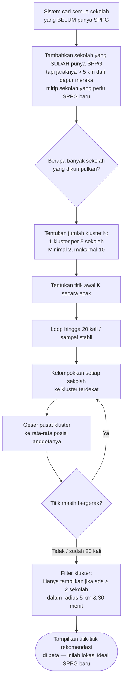

---

### 4c. Validasi Titik — Sistem Beri Sinyal Lampu Lalu Lintas

Saat SuperAdmin memilih titik baru di peta, sistem langsung mengecek apakah lokasi tersebut layak.

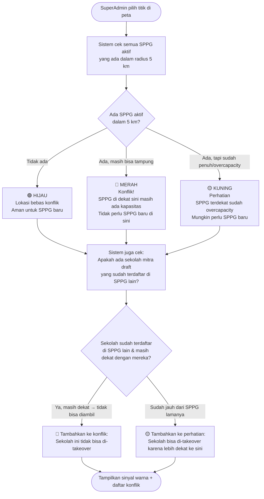

---

### 4d. Saran Geser Titik ke Posisi Optimal

Fitur ini membantu SuperAdmin menemukan posisi **tengah-tengah** dari semua mitra yang ada.

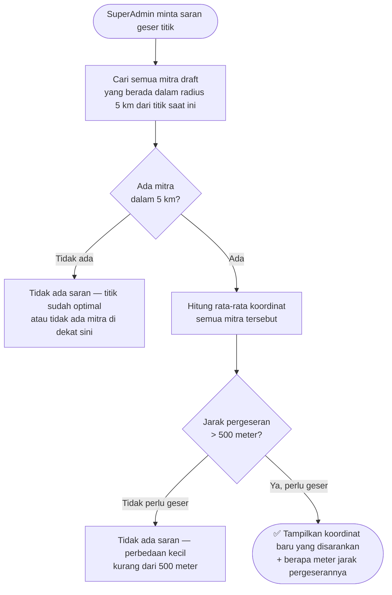

---

### 4e. Cek Rute Antara Dua Titik

SuperAdmin bisa mengecek jarak dan waktu tempuh antara dua titik mana saja di peta.

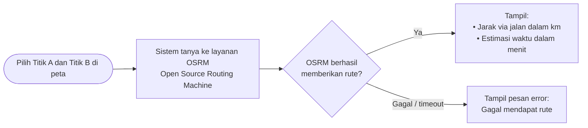

---

## 5️⃣ Manajemen Sekolah — Data Induk Mitra

SuperAdmin mengelola **database sekolah** yang menjadi calon mitra SPPG.

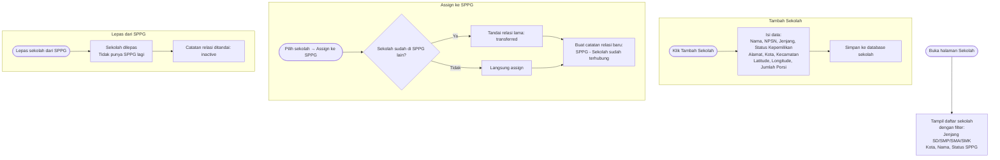

> **Perbedaan Sekolah vs Mitra:** `Sekolah` adalah database induk. `Mitra (Partner)` adalah sekolah yang sudah terhubung ke SPPG tertentu. Saat sekolah di-assign, mereka menjadi mitra SPPG tersebut.

---

## 6️⃣ Manajemen Karyawan — Per SPPG

Setiap SPPG memiliki karyawan sendiri. SuperAdmin bisa mengelola karyawan di setiap SPPG.

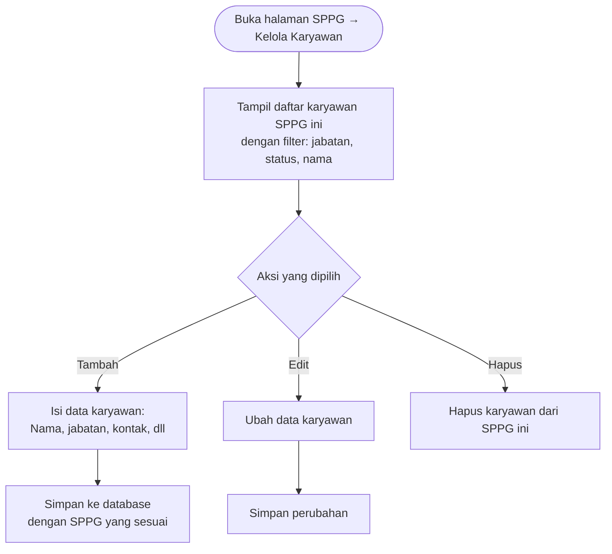

---

## 7️⃣ Laporan Keuangan

> ⚠️ **Fitur ini masih dalam pengembangan.** Endpoint sudah tersedia tapi belum ada implementasi logika bisnis. Rencananya akan mendukung: tambah laporan, lihat laporan, edit, dan hapus.

---

## 🔐 Keamanan Akses — Siapa Yang Bisa Akses Apa?

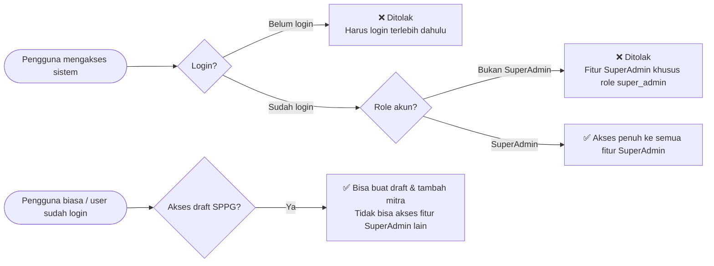

**Aturan akses:**
| Fitur | SuperAdmin | User Biasa (Login) | Publik |
|---|---|---|---|
| Dashboard, SPPG, Peta, Sekolah, Karyawan | ✅ | ❌ | ❌ |
| Buat draft pengajuan SPPG | ✅ | ✅ | ❌ |
| Konfirmasi titik & submit SPPG | ✅ | ❌ | ❌ |

---

## 📊 Status & Label yang Perlu Dipahami

### Status SPPG
| Status | Artinya |
|---|---|
| `active` | SPPG beroperasi normal |
| `inactive` | SPPG dinonaktifkan sementara, karyawan tidak bisa login |
| `pending` | SPPG baru didaftarkan, belum aktif |
| `deleted` | SPPG telah dihapus |

### Status Draft Pengajuan
| Status | Artinya |
|---|---|
| `draft` | Masih dalam proses pengisian |
| `registered` | Sudah di-submit, SPPG resmi terdaftar |

### Status Titik di Peta
| Warna | Artinya |
|---|---|
| 🟢 Hijau | Lokasi aman, tidak ada konflik |
| 🟡 Kuning | Ada perhatian, tapi masih bisa dilanjutkan |
| 🔴 Merah | Ada konflik serius, perlu ditinjau ulang |

### Status Sekolah di Peta
| Status | Artinya |
|---|---|
| `served` | Sudah terhubung ke SPPG dan dalam jangkauan ≤ 5 km |
| `unserved` | Belum terhubung ke SPPG manapun |
| `takeover_candidate` | Terhubung ke SPPG tapi jaraknya > 5 km — kandidat pindah SPPG |

### Status Mitra dalam Draft
| Data Source | Artinya |
|---|---|
| `manual` | Ditambahkan manual oleh pengguna |
| `system_recommendation` | Ditambahkan otomatis saat konfirmasi titik |
| `database` | Dari database sekolah yang ada |
| `out_of_range` | Mitra ini di luar jangkauan 5 km / 30 menit |

---

## 🔄 Ringkasan Seluruh Alur dalam Satu Diagram

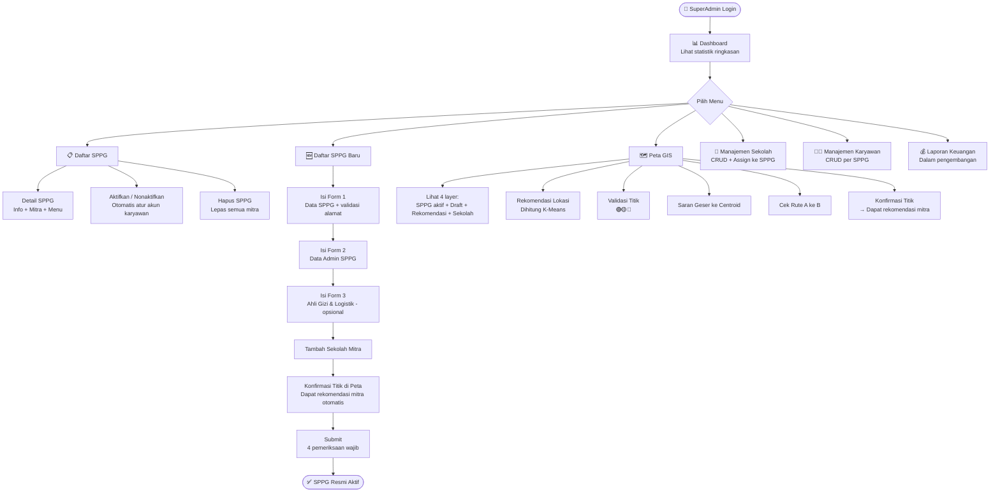

---

*Dokumen ini dibuat otomatis berdasarkan analisis kode backend COMS-MBG — branch `dev`, commit terakhir: `f8c27e3`*
