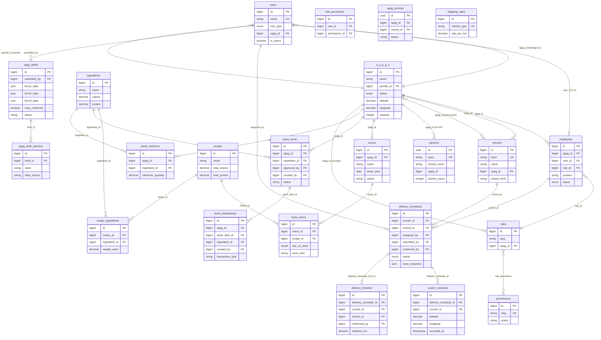

# Analisa Tabel Database COMS-MBG
## Skema Lengkap & Hubungan Antar Tabel

---

## 📊 RINGKASAN TABEL

| # | Nama Tabel | Tipe | Jumlah Kolom | Primary Key |
|---|-----------|------|-------------|-------------|
| 1 | `users` | Core | 10 | `id` (bigint) |
| 2 | `s_p_p_g_s` | Core | 13 | `id` (bigint) |
| 3 | `employees` | Core | 12 | `id` (bigint) |
| 4 | `roles` | RBAC | 6 | `id` (bigint) |
| 5 | `permissions` | RBAC | 7 | `id` (bigint) |
| 6 | `role_permission` | Pivot | 4 | `id` (bigint) |
| 7 | `schools` | Operasi | 15 | `id` (bigint) |
| 8 | `sppg_schools` | Pivot | 7 | `id` (uuid) |
| 9 | `partners` | Operasi | 13 | `id` (uuid) |
| 10 | `ingredients` | Gizi | 8 | `id` (bigint) |
| 11 | `recipes` | Gizi | 11 | `id` (bigint) |
| 12 | `recipe_ingredients` | Pivot | 8 | `id` (bigint) |
| 13 | `menus` | Gizi | 8 | `id` (bigint) |
| 14 | `menu_items` | Gizi | 7 | `id` (bigint) |
| 15 | `delivery_schedules` | Distribusi | 21 | `id` (bigint) |
| 16 | `courier_locations` | Distribusi | 7 | `id` (bigint) |
| 17 | `delivery_histories` | Distribusi | 16 | `id` (bigint) |
| 18 | `shipping_rates` | Distribusi | 5 | `id` (bigint) |
| 19 | `stock_items` | Stok | 16 | `id` (bigint) |
| 20 | `stock_minimum` | Stok | 5 | `id` (bigint) |
| 21 | `stock_transactions` | Stok | 12 | `id` (bigint) |
| 22 | `sppg_drafts` | Pengajuan | 13 | `id` (bigint) |
| 23 | `sppg_draft_partners` | Pengajuan | 11 | `id` (bigint) |
| 24 | `feedback` | Publik | 6 | `id` (bigint) |
| 25 | `sessions` | Auth | 5 | `id` (string) |
| 26 | `password_reset_tokens` | Auth | 3 | `email` |

---

## 🗂️ DETAIL PER TABEL

---

### 1. `users`
Akun login semua aktor sistem (Super Admin & semua staf SPPG).

| Kolom | Tipe | Constraint | Keterangan |
|-------|------|-----------|-----------|
| `id` | bigint | PK, AI | |
| `name` | varchar | NOT NULL | |
| `email` | varchar | UNIQUE | |
| `password` | varchar | NOT NULL | hashed via model cast |
| `phone` | varchar | nullable | |
| `profile_picture` | varchar | nullable | |
| `is_active` | boolean | default: true | |
| `role_type` | enum | `super_admin`, `sppg_user` | default: `sppg_user` |
| `sppg_id` | bigint (FK) | nullable, nullOnDelete | → `s_p_p_g_s.id` |
| `email_verified_at` | timestamp | nullable | |
| `remember_token` | varchar | nullable | |
| `created_at`, `updated_at` | timestamp | | |

---

### 2. `s_p_p_g_s`
Satuan Penyelenggara Program Gizi — unit operasional utama sistem.

| Kolom | Tipe | Constraint | Keterangan |
|-------|------|-----------|-----------|
| `id` | bigint | PK, AI | |
| `name` | varchar | NOT NULL | |
| `address` | varchar | nullable | |
| `district` | varchar | nullable | |
| `city` | varchar | nullable | |
| `province` | varchar | nullable | |
| `latitude` | decimal(10,7) | nullable | |
| `longitude` | decimal(10,7) | nullable | |
| `capacity` | integer | nullable | Kapasitas maks sekolah mitra |
| `phone` | varchar | nullable | |
| `email` | varchar | nullable | |
| `status` | enum | `active`, `inactive`, `pending` | default: `pending` |
| `pemilik_id` | bigint (FK) | nullable, nullOnDelete | → `users.id` |
| `deleted_at` | timestamp | SoftDeletes | |
| `created_at`, `updated_at` | timestamp | | |

---

### 3. `employees`
Karyawan SPPG — bridge antara `users` dan `roles` per SPPG.

| Kolom | Tipe | Constraint | Keterangan |
|-------|------|-----------|-----------|
| `id` | bigint | PK, AI | |
| `sppg_id` | bigint (FK) | NOT NULL, cascadeDelete | → `s_p_p_g_s.id` |
| `user_id` | bigint (FK) | nullable, nullOnDelete | → `users.id` |
| `role_id` | bigint (FK) | nullable, nullOnDelete | → `roles.id` |
| `name` | varchar | NOT NULL | |
| `nik` | varchar | nullable, UNIQUE | Nomor Induk Karyawan |
| `position` | varchar | nullable | `owner`, `courier`, `nutritionist`, `logistics_admin` |
| `phone` | varchar | nullable | |
| `address` | varchar | nullable | |
| `photo` | varchar | nullable | |
| `joined_at` | date | nullable | |
| `base_salary` | decimal(15,2) | nullable | |
| `status` | enum | `active`, `inactive` | default: `active` |
| `created_at`, `updated_at` | timestamp | | |

---

### 4. `roles`
Role RBAC yang di-scope per SPPG (setiap SPPG punya set role sendiri).

| Kolom | Tipe | Constraint | Keterangan |
|-------|------|-----------|-----------|
| `id` | bigint | PK, AI | |
| `name` | varchar | NOT NULL | Display name |
| `slug` | varchar | UNIQUE per `sppg_id` | Identifier teknis |
| `description` | text | nullable | |
| `sppg_id` | bigint (FK) | nullable, nullOnDelete | → `s_p_p_g_s.id` |
| `deleted_at` | timestamp | SoftDeletes | |
| `created_at`, `updated_at` | timestamp | | |

**Unique constraint:** `(slug, sppg_id)` — slug yang sama boleh ada di SPPG berbeda.

---

### 5. `permissions`
Daftar permission sistem (global, tidak di-scope per SPPG).

| Kolom | Tipe | Constraint | Keterangan |
|-------|------|-----------|-----------|
| `id` | bigint | PK, AI | |
| `name` | varchar | NOT NULL | Display name |
| `slug` | varchar | UNIQUE | Identifier: `employee.create`, dll |
| `module` | varchar | nullable | Grup modul |
| `feature` | varchar | nullable | Fitur spesifik |
| `action` | enum | nullable | `create`, `read`, `update`, `delete` |
| `created_at`, `updated_at` | timestamp | | |

---

### 6. `role_permission` *(Pivot)*
Penghubung many-to-many antara `roles` dan `permissions`.

| Kolom | Tipe | Constraint |
|-------|------|-----------|
| `id` | bigint | PK, AI |
| `role_id` | bigint (FK) | cascadeDelete → `roles.id` |
| `permission_id` | bigint (FK) | cascadeDelete → `permissions.id` |
| `created_at`, `updated_at` | timestamp | |

**Unique constraint:** `(role_id, permission_id)` — tidak boleh duplikat.

---

### 7. `schools`
Sekolah fisik yang menjadi mitra/penerima makanan (data dari dinas pendidikan).

| Kolom | Tipe | Constraint | Keterangan |
|-------|------|-----------|-----------|
| `id` | bigint | PK, AI | |
| `npsn` | varchar(50) | nullable, UNIQUE | Nomor Pokok Sekolah Nasional |
| `name` | varchar | nullable | |
| `address` | varchar(1000) | nullable | |
| `latitude` | decimal(10,7) | nullable | |
| `longitude` | decimal(10,7) | nullable | |
| `student_count` | integer | nullable | |
| `school_level` | varchar | nullable | SD, SMP, SMA, SMK |
| `district` | varchar | nullable | Kecamatan |
| `city` | varchar | nullable | Kota/Kabupaten |
| `province` | varchar | nullable | |
| `phone` | varchar | nullable | |
| `principal` | varchar | nullable | Nama kepala sekolah |
| `sppg_id` | bigint (FK) | nullable, setNull | → `s_p_p_g_s.id` |
| `status` | varchar | default: `active` | |
| `deleted_at` | timestamp | SoftDeletes | |
| `created_at`, `updated_at` | timestamp | | |

---

### 8. `sppg_schools` *(Pivot / Junction)*
Histori keanggotaan sekolah dalam SPPG (many-to-many dengan metadata).

| Kolom | Tipe | Constraint | Keterangan |
|-------|------|-----------|-----------|
| `id` | uuid | PK | |
| `sppg_id` | bigint (FK) | cascadeDelete → `s_p_p_g_s.id` | |
| `school_id` | bigint (FK) | cascadeDelete → `schools.id` | |
| `tanggal_bergabung` | date | nullable | ⚠️ Nama masih Indonesia (`joined_at` di kode model) |
| `status` | varchar(50) | default: `aktif` | ⚠️ Nilai enum masih Indonesia |
| `catatan` | text | nullable | ⚠️ Nama masih Indonesia |
| `created_at`, `updated_at` | timestamp | | |

---

### 9. `partners`
Data mitra sekolah yang terdaftar aktif di satu SPPG (kini linked via NPSN).

| Kolom | Tipe | Constraint | Keterangan |
|-------|------|-----------|-----------|
| `id` | uuid | PK | |
| `school_name` | varchar | NOT NULL | |
| `npsn` | varchar | nullable, UNIQUE | Kunci sinkronisasi dengan `schools` |
| `school_type` | varchar(50) | NOT NULL | SMA, SMK, MA, dll |
| `ownership_status` | varchar(50) | NOT NULL | negeri/swasta |
| `address` | text | nullable | |
| `district` | varchar(100) | nullable | |
| `city` | varchar(100) | nullable | |
| `latitude` | decimal(10,7) | nullable | |
| `longitude` | decimal(10,7) | nullable | |
| `portion_count` | unsigned int | default: 0 | Jumlah porsi per hari |
| `sppg_id` | bigint | nullable, INDEX | ⚠️ **Tidak ada FK formal** → `s_p_p_g_s.id` |
| `deleted_at` | timestamp | SoftDeletes | |
| `created_at`, `updated_at` | timestamp | | |

> ⚠️ **Catatan:** `sppg_id` di tabel `partners` **tidak memiliki foreign key constraint** di migration. Ini bisa menyebabkan data orphan jika SPPG dihapus.

---

### 10. `ingredients`
Bahan baku/bahan makanan dengan nilai nutrisi per 100g (atau per `serving_weight`).

| Kolom | Tipe | Constraint | Keterangan |
|-------|------|-----------|-----------|
| `id` | bigint | PK, AI | |
| `name` | varchar | NOT NULL | |
| `carbohydrate` | decimal(8,2) | default: 0 | gram per serving |
| `protein` | decimal(8,2) | default: 0 | gram per serving |
| `calorie` | decimal(8,2) | default: 0 | kkal per serving |
| `fat` | decimal(8,2) | default: 0 | gram per serving |
| `serving_weight` | decimal(8,2) | default: 100 | gram acuan nilai nutrisi |
| `description` | text | nullable | |
| `created_at`, `updated_at` | timestamp | | |

---

### 11. `recipes`
Resep yang berisi kombinasi bahan makanan dengan kalkulasi total nutrisi.

| Kolom | Tipe | Constraint | Keterangan |
|-------|------|-----------|-----------|
| `id` | bigint | PK, AI | |
| `name` | varchar | NOT NULL | |
| `description` | text | nullable | |
| `target_calorie` | decimal(10,2) | default: 0 | Target nutrisi (input) |
| `target_protein` | decimal(10,2) | default: 0 | |
| `target_carbohydrate` | decimal(10,2) | default: 0 | |
| `target_fat` | decimal(10,2) | default: 0 | |
| `total_calorie` | decimal(10,2) | default: 0 | Hasil kalkulasi (output) |
| `total_protein` | decimal(10,2) | default: 0 | |
| `total_carbohydrate` | decimal(10,2) | default: 0 | |
| `total_fat` | decimal(10,2) | default: 0 | |
| `total_weight` | decimal(10,2) | default: 0 | |
| `deleted_at` | timestamp | SoftDeletes | |
| `created_at`, `updated_at` | timestamp | | |

---

### 12. `recipe_ingredients` *(Pivot)*
Bahan-bahan dalam satu resep beserta kontribusi nutrisi masing-masing.

| Kolom | Tipe | Constraint | Keterangan |
|-------|------|-----------|-----------|
| `id` | bigint | PK, AI | |
| `recipe_id` | bigint (FK) | cascadeDelete → `recipes.id` | |
| `ingredient_id` | bigint (FK) | cascadeDelete → `ingredients.id` | |
| `weight_used` | decimal(10,2) | NOT NULL | Berat digunakan (gram) |
| `calorie_contribution` | decimal(10,2) | default: 0 | Kalori dari bahan ini |
| `protein_contribution` | decimal(10,2) | default: 0 | |
| `carbohydrate_contribution` | decimal(10,2) | default: 0 | |
| `fat_contribution` | decimal(10,2) | default: 0 | |
| `order` | integer | default: 0 | Urutan tampil |
| `created_at`, `updated_at` | timestamp | | |

---

### 13. `menus`
Rencana menu mingguan yang dimiliki oleh SPPG.

| Kolom | Tipe | Constraint | Keterangan |
|-------|------|-----------|-----------|
| `id` | bigint | PK, AI | |
| `sppg_id` | bigint (FK) | nullable, nullOnDelete → `s_p_p_g_s.id` | ⚠️ Ditambah via migration terpisah |
| `name` | varchar | NOT NULL | |
| `week_start` | date | NOT NULL | |
| `week_end` | date | NOT NULL | |
| `status` | varchar | default: `planned` | `planned`, `scheduled`, `published`, `archived` |
| `notes` | text | nullable | |
| `deleted_at` | timestamp | SoftDeletes | |
| `created_at`, `updated_at` | timestamp | | |

**Indexes:** `(week_start, week_end)`, `status`

---

### 14. `menu_items`
Item resep yang ada di tiap hari dalam sebuah menu mingguan.

| Kolom | Tipe | Constraint | Keterangan |
|-------|------|-----------|-----------|
| `id` | bigint | PK, AI | |
| `menu_id` | bigint (FK) | cascadeDelete → `menus.id` | |
| `recipe_id` | bigint (FK) | restrict → `recipes.id` | |
| `day_of_week` | tinyint | NOT NULL | 1=Senin s/d 7=Minggu |
| `menu_date` | date | nullable | Tanggal spesifik |
| `meal_time` | varchar(50) | nullable | Waktu makan: sarapan, makan siang, dll |
| `order` | unsigned int | default: 1 | Urutan dalam satu hari |
| `created_at`, `updated_at` | timestamp | | |

**Indexes:** `(menu_id, day_of_week)`, `recipe_id`

---

### 15. `delivery_schedules`
Jadwal pengiriman makanan dari SPPG ke sekolah (state machine distribusi).

| Kolom | Tipe | Constraint | Keterangan |
|-------|------|-----------|-----------|
| `id` | bigint | PK, AI | |
| `courier_id` | bigint (FK) | restrict → `employees.id` | |
| `school_id` | bigint (FK) | restrict → `schools.id` | |
| `assigned_by` | bigint (FK) | restrict → `users.id` | Admin Logistik |
| `submitted_by` | bigint (FK) | nullable, setNull → `users.id` | Admin SPPG |
| `vehicle_type` | varchar(50) | nullable | `motorcycle`, `car`, `van`, `truck` |
| `vehicle_plate` | varchar(20) | nullable | |
| `status` | enum | default: `in_order` | `in_order`, `accepted`, `rejected`, `delivering`, `delivered`, `confirmed`, `revision_required` |
| `scheduled_at` | timestamp | nullable | |
| `departed_at` | timestamp | nullable | |
| `arrived_at` | timestamp | nullable | |
| `delivery_notes` | text | nullable | |
| `rejection_reason` | text | nullable | |
| `rejection_photo_path` | varchar | nullable | |
| `rejected_at` | timestamp | nullable | |
| `proof_photo_path` | varchar | nullable | |
| `proof_submitted_at` | timestamp | nullable | |
| `confirmed_by` | bigint (FK) | nullable, setNull → `users.id` | |
| `confirmed_at` | timestamp | nullable | |
| `confirmation_notes` | text | nullable | |
| `route_snapshot` | json | nullable | GeoJSON LineString rute aktual |
| `deleted_at` | timestamp | SoftDeletes | |
| `created_at`, `updated_at` | timestamp | | |

**Indexes:** `(status, courier_id)`, `scheduled_at`

---

### 16. `courier_locations`
GPS ping real-time dari kurir selama pengiriman berlangsung.

| Kolom | Tipe | Constraint | Keterangan |
|-------|------|-----------|-----------|
| `id` | bigint | PK, AI | |
| `delivery_schedule_id` | bigint (FK) | cascadeDelete → `delivery_schedules.id` | |
| `courier_id` | bigint (FK) | cascadeDelete → `employees.id` | |
| `latitude` | decimal(10,7) | NOT NULL | |
| `longitude` | decimal(10,7) | NOT NULL | |
| `speed_kmh` | float | nullable | |
| `heading_degrees` | float | nullable | 0-360 kompas |
| `accuracy_meters` | float | nullable | Akurasi GPS |
| `recorded_at` | timestamp | default: now | |

**Indexes:** `(delivery_schedule_id, recorded_at)`, `(courier_id, recorded_at)`
> **Catatan:** Tabel ini tidak memiliki `updated_at` (append-only time-series data).

---

### 17. `delivery_histories`
Arsip permanen pengiriman yang telah dikonfirmasi (snapshot data saat konfirmasi).

| Kolom | Tipe | Constraint | Keterangan |
|-------|------|-----------|-----------|
| `id` | bigint | PK, AI | |
| `delivery_schedule_id` | bigint (FK) | restrict → `delivery_schedules.id` | |
| `courier_id` | bigint (FK) | restrict → `employees.id` | |
| `school_id` | bigint (FK) | restrict → `schools.id` | |
| `courier_name` | varchar(100) | NOT NULL | Snapshot nama kurir |
| `school_name` | varchar(150) | NOT NULL | Snapshot nama sekolah |
| `school_address` | varchar(255) | nullable | |
| `vehicle_type` | varchar(50) | nullable | |
| `vehicle_plate` | varchar(20) | nullable | |
| `departed_at` | timestamp | nullable | |
| `arrived_at` | timestamp | nullable | |
| `duration_minutes` | integer | **STORED AS** (computed) | `EXTRACT(EPOCH FROM (arrived_at - departed_at)) / 60` |
| `proof_photo_path` | varchar | nullable | |
| `route_snapshot` | json | nullable | GeoJSON rute |
| `distance_km` | decimal(8,3) | nullable | |
| `confirmed_by` | bigint (FK) | nullable, setNull → `users.id` | |
| `confirmed_at` | timestamp | nullable | |
| `notes` | text | nullable | |
| `created_at`, `updated_at` | timestamp | | |

**Indexes:** `courier_id`, `school_id`, `departed_at`

---

### 18. `shipping_rates`
Tarif ongkos kirim per km berdasarkan jenis kendaraan (lookup table).

| Kolom | Tipe | Constraint | Keterangan |
|-------|------|-----------|-----------|
| `id` | bigint | PK, AI | |
| `vehicle_type` | varchar | UNIQUE | `motorcycle`, `car`, `van`, `truck` |
| `rate_per_km` | decimal(10,2) | NOT NULL | IDR per km |
| `is_active` | boolean | default: true | |
| `notes` | text | nullable | |
| `created_at`, `updated_at` | timestamp | | |

**Pre-seeded values:** Motor: 2.500, Mobil: 4.000, Van: 6.000, Truk: 10.000

---

### 19. `stock_items`
Batch stok bahan makanan per SPPG (satu record = satu batch pembelian).

| Kolom | Tipe | Constraint | Keterangan |
|-------|------|-----------|-----------|
| `id` | bigint | PK, AI | |
| `sppg_id` | bigint (FK) | cascadeDelete → `s_p_p_g_s.id` | |
| `ingredient_id` | bigint (FK) | cascadeDelete → `ingredients.id` | |
| `batch_number` | varchar(100) | nullable | |
| `quantity` | decimal(10,3) | NOT NULL | |
| `unit` | varchar(20) | NOT NULL | `kg`, `liter`, `gram`, `ml`, `pcs` |
| `price_per_unit` | decimal(12,2) | NOT NULL | |
| `purchase_date` | date | NOT NULL | |
| `expiry_date` | date | NOT NULL | |
| `supplier` | varchar(255) | NOT NULL | |
| `storage_type` | varchar(50) | NOT NULL | `dry`, `chilled`, `frozen` |
| `storage_location` | varchar(255) | nullable | |
| `sku` | varchar(100) | nullable | |
| `notes` | text | nullable | |
| `status` | varchar(50) | default: `pending` | `pending`, `available`, `low`, `empty`, `expired` |
| `approved_by` | bigint (FK) | nullable, setNull → `users.id` | |
| `approved_at` | datetime | nullable | |
| `proof_document` | varchar(500) | nullable | Dokumen/foto bukti pembelian |
| `created_by` | bigint (FK) | cascadeDelete → `users.id` | |
| `deleted_at` | timestamp | SoftDeletes | |
| `created_at`, `updated_at` | timestamp | | |

**Indexes:** `sppg_id`, `ingredient_id`, `status`

---

### 20. `stock_minimum`
Batas minimum stok per bahan per SPPG (threshold alert).

| Kolom | Tipe | Constraint | Keterangan |
|-------|------|-----------|-----------|
| `id` | bigint | PK, AI | |
| `sppg_id` | bigint (FK) | cascadeDelete → `s_p_p_g_s.id` | |
| `ingredient_id` | bigint (FK) | cascadeDelete → `ingredients.id` | |
| `minimum_quantity` | decimal(10,3) | NOT NULL | |
| `unit` | varchar(20) | NOT NULL | |
| `created_at`, `updated_at` | timestamp | | |

**Unique constraint:** `(sppg_id, ingredient_id)` — satu threshold per bahan per SPPG.

---

### 21. `stock_transactions`
Log transaksi masuk/keluar stok (append-only, tidak ada `updated_at`).

| Kolom | Tipe | Constraint | Keterangan |
|-------|------|-----------|-----------|
| `id` | bigint | PK, AI | |
| `sppg_id` | bigint (FK) | cascadeDelete → `s_p_p_g_s.id` | |
| `stock_item_id` | bigint (FK) | cascadeDelete → `stock_items.id` | |
| `ingredient_id` | bigint (FK) | cascadeDelete → `ingredients.id` | |
| `transaction_type` | varchar(50) | NOT NULL | `in`, `out`, `adjustment`, `expired_disposal` |
| `quantity` | decimal(10,3) | NOT NULL | Jumlah transaksi |
| `quantity_before` | decimal(10,3) | NOT NULL | Snapshot sebelum |
| `quantity_after` | decimal(10,3) | NOT NULL | Snapshot sesudah |
| `reference_type` | varchar(100) | nullable | Jenis referensi (morph) |
| `reference_id` | bigint | nullable | ID referensi (morph) |
| `notes` | text | nullable | |
| `created_by` | bigint (FK) | cascadeDelete → `users.id` | |
| `created_at` | timestamp | default: now | **Immutable** — tidak ada `updated_at` |

**Indexes:** `sppg_id`, `stock_item_id`, `ingredient_id`

---

### 22. `sppg_drafts`
Draft pengajuan pendirian SPPG baru (multi-step form dalam JSON).

| Kolom | Tipe | Constraint | Keterangan |
|-------|------|-----------|-----------|
| `id` | bigint | PK, AI | |
| `submission_number` | varchar(50) | nullable, UNIQUE | Format: `DRAFT-YYYYMMDD-001` |
| `submitted_by` | bigint (FK) | nullable, setNull → `users.id` | |
| `source` | varchar(20) | default: `internal` | `internal`, `public` |
| `form1_data` | json | nullable | Data SPPG (nama, alamat, koordinat, kapasitas) |
| `form2_data` | json | nullable | Data Admin SPPG (nama, email, password) |
| `form3_data` | json | nullable | Data Ahli Gizi & Admin Logistik |
| `latitude` | decimal(10,8) | nullable | Koordinat dari geocoding alamat |
| `longitude` | decimal(11,8) | nullable | |
| `confirmed_latitude` | decimal(10,8) | nullable | Koordinat yang digeser SuperAdmin |
| `confirmed_longitude` | decimal(11,8) | nullable | |
| `point_status` | varchar(20) | nullable | `green`, `yellow`, `red` |
| `map_confirmed` | boolean | default: false | Apakah SuperAdmin sudah konfirmasi |
| `status` | varchar(20) | default: `draft` | `draft`, `submitted`, `registered` |
| `submitted_at` | datetime | nullable | |
| `deleted_at` | timestamp | SoftDeletes | |
| `created_at`, `updated_at` | timestamp | | |

---

### 23. `sppg_draft_partners`
Daftar sekolah mitra dalam sebuah draft pengajuan SPPG.

| Kolom | Tipe | Constraint | Keterangan |
|-------|------|-----------|-----------|
| `id` | bigint | PK, AI | |
| `draft_id` | bigint (FK) | cascadeDelete → `sppg_drafts.id` | |
| `school_name` | varchar(255) | NOT NULL | |
| `npsn` | varchar(20) | nullable | |
| `level` | varchar(20) | nullable | SD, SMP, SMA, SMK |
| `school_status` | varchar(20) | nullable | negeri, swasta |
| `address` | text | NOT NULL | |
| `city` | varchar(100) | NOT NULL | |
| `district` | varchar(100) | NOT NULL | |
| `latitude` | decimal(10,8) | nullable | Nullable setelah migration fix |
| `longitude` | decimal(11,8) | nullable | |
| `jumlah_porsi` | integer | NOT NULL | ⚠️ Nama masih Indonesia |
| `data_source` | varchar(30) | NOT NULL | `manual`, `database`, `system_recommendation`, `out_of_range` |
| `created_at`, `updated_at` | timestamp | | |

---

### 24. `feedback`
Ulasan/testimoni publik (landing page).

| Kolom | Tipe | Keterangan |
|-------|------|-----------|
| `id` | bigint | PK |
| `name` | varchar | Nama pemberi ulasan |
| `role` | varchar | nullable — Peran: Wali Murid, Guru, dll |
| `message` | text | Isi ulasan |
| `rating` | tinyint | 1-5, default: 5 |
| `is_approved` | boolean | Moderasi, default: false |
| `created_at`, `updated_at` | timestamp | |

---

## 🔗 PETA RELASI ANTAR TABEL

### Diagram ERD (Mermaid)



---

## 📐 KARDINALITAS SEMUA RELASI

### Domain Auth & RBAC
| Dari | Ke | Kardinalitas | Via |
|------|-----|-------------|-----|
| `s_p_p_g_s` | `users` | **1:N** | `users.sppg_id` — satu SPPG punya banyak user |
| `s_p_p_g_s` | `users` | **1:1** | `s_p_p_g_s.pemilik_id` — satu SPPG punya satu owner |
| `s_p_p_g_s` | `employees` | **1:N** | `employees.sppg_id` |
| `users` | `employees` | **1:1** | `employees.user_id` |
| `employees` | `roles` | **N:1** | `employees.role_id` |
| `roles` | `s_p_p_g_s` | **N:1** | `roles.sppg_id` (scoped per SPPG) |
| `roles` | `permissions` | **M:N** | `role_permission` |

### Domain Sekolah & Mitra
| Dari | Ke | Kardinalitas | Via |
|------|-----|-------------|-----|
| `s_p_p_g_s` | `schools` | **1:N** | `schools.sppg_id` (current assignment) |
| `s_p_p_g_s` | `schools` | **M:N** | `sppg_schools` (history pivot) |
| `s_p_p_g_s` | `partners` | **1:N** | `partners.sppg_id` (tanpa FK formal) |
| `schools` | `partners` | **0:1** | via NPSN (tidak ada FK, sinkronisasi manual) |

### Domain Gizi & Menu
| Dari | Ke | Kardinalitas | Via |
|------|-----|-------------|-----|
| `s_p_p_g_s` | `menus` | **1:N** | `menus.sppg_id` |
| `menus` | `menu_items` | **1:N** | `menu_items.menu_id` |
| `recipes` | `menu_items` | **1:N** | `menu_items.recipe_id` |
| `recipes` | `ingredients` | **M:N** | `recipe_ingredients` |

### Domain Distribusi
| Dari | Ke | Kardinalitas | Via |
|------|-----|-------------|-----|
| `employees` | `delivery_schedules` | **1:N** | `delivery_schedules.courier_id` |
| `schools` | `delivery_schedules` | **1:N** | `delivery_schedules.school_id` |
| `users` | `delivery_schedules` | **1:N** | `assigned_by`, `submitted_by`, `confirmed_by` |
| `delivery_schedules` | `courier_locations` | **1:N** | `courier_locations.delivery_schedule_id` |
| `delivery_schedules` | `delivery_histories` | **1:1** | `delivery_histories.delivery_schedule_id` |
| `employees` | `courier_locations` | **1:N** | `courier_locations.courier_id` |
| `employees` | `delivery_histories` | **1:N** | `delivery_histories.courier_id` |

### Domain Stok
| Dari | Ke | Kardinalitas | Via |
|------|-----|-------------|-----|
| `s_p_p_g_s` | `stock_items` | **1:N** | `stock_items.sppg_id` |
| `ingredients` | `stock_items` | **1:N** | `stock_items.ingredient_id` |
| `stock_items` | `stock_transactions` | **1:N** | `stock_transactions.stock_item_id` |
| `s_p_p_g_s` | `stock_minimum` | **1:N** | `stock_minimum.sppg_id` |
| `ingredients` | `stock_minimum` | **1:N** | `stock_minimum.ingredient_id` |

### Domain Pengajuan
| Dari | Ke | Kardinalitas | Via |
|------|-----|-------------|-----|
| `users` | `sppg_drafts` | **1:N** | `sppg_drafts.submitted_by` |
| `sppg_drafts` | `sppg_draft_partners` | **1:N** | `sppg_draft_partners.draft_id` |

---

## ⚠️ MASALAH SKEMA YANG DITEMUKAN

### 🔴 1. `partners.sppg_id` — Tidak Ada Foreign Key Constraint
```sql
-- Migration hanya menambahkan INDEX, bukan FOREIGN KEY
$table->unsignedBigInteger('sppg_id')->nullable()->index();
-- ↑ Tidak ada: ->constrained('s_p_p_g_s')
```
**Risiko:** Jika SPPG dihapus, `partners.sppg_id` tidak otomatis di-null → data orphan.

---

### 🟠 2. `sppg_schools` — Kolom Nama Masih Indonesia
```sql
tanggal_bergabung   -- seharusnya: joined_at
status = 'aktif'    -- seharusnya: 'active'
catatan             -- seharusnya: notes
```
Kode model (`SPPGSchool.php`) sudah menggunakan `joined_at` dan `status = 'active'`, tapi migration masih dalam bahasa Indonesia → **inkonsistensi naming yang bisa menyebabkan bug**.

---

### 🟡 3. `schools` dan `partners` — Relasi Hanya via NPSN (Tidak Ada FK)
Dua tabel ini menyimpan data sekolah yang sama tetapi tidak terhubung via FK formal. Sinkronisasi dilakukan secara manual di service layer:
```php
// Di SPPGService::assignSchool()
if ($school->npsn) {
    Partner::where('npsn', $school->npsn)->update(['sppg_id' => $sppg->id]);
}
```
**Risiko:** Jika sinkronisasi tidak dipanggil, data bisa tidak konsisten antara dua tabel.

---

### 🟡 4. `menus.sppg_id` — Ditambahkan via Migration Terpisah
`sppg_id` di tabel `menus` tidak ada di migration awal, melainkan ditambahkan via:
```
2026_06_06_000004_add_sppg_id_to_menus_table.php
```
Ini bukan masalah teknis, tapi penting untuk dipahami bahwa **menu tidak selalu punya `sppg_id`** jika ada data lama yang di-create sebelum migration ini.

---

### 🟡 5. `sppg_draft_partners` — Kolom `jumlah_porsi` Masih Indonesia
```sql
$table->integer('jumlah_porsi');
-- seharusnya: portion_count (sesuai partners.portion_count)
```
Inkonsistensi naming dengan tabel `partners` yang sudah menggunakan `portion_count`.

---

### 🟢 6. `delivery_histories.duration_minutes` — Computed Column
```sql
duration_minutes STORED AS "EXTRACT(EPOCH FROM (arrived_at - departed_at)) / 60"
```
Ini adalah **stored generated column** yang hanya berfungsi di **PostgreSQL**. Di SQLite (testing), kolom ini menjadi `integer` biasa yang tidak dihitung otomatis. Jika testing menggunakan SQLite, nilai `duration_minutes` tidak akan terisi.

---

### 🟢 7. Tidak Ada Tabel untuk Route/Navigation History
`delivery_schedules.route_snapshot` menyimpan GeoJSON rute dalam JSON — ini menggabungkan data operasional (jadwal) dengan data analytics (rute). Untuk skala besar, sebaiknya dipisahkan ke tabel sendiri atau dipindahkan ke `delivery_histories` saja (yang sudah ada `route_snapshot` juga).

---

*Dokumen ini dibuat berdasarkan analisa 46 file migration pada: 2026-06-12*
