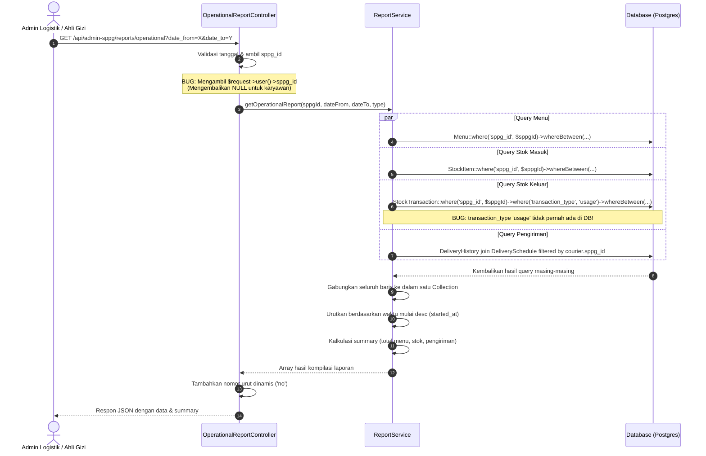
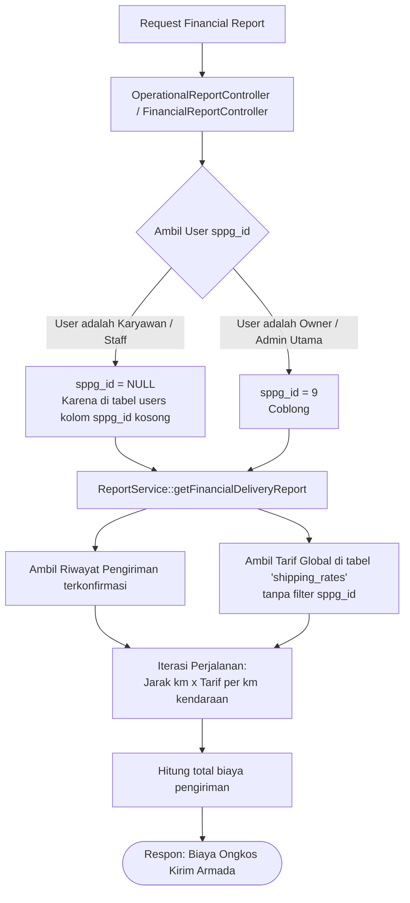

# 📊 Analisis Fitur Laporan Operasional & Keuangan (Sisi Backend)
Sistem Makan Bergizi Gratis (MBG) — SPPG Sisi Admin

Dokumen ini menganalisis secara terpisah arsitektur logika, alur penelusuran database, celah fungsional (gaps), serta bug teknis yang ada pada fitur **Laporan Operasional** dan **Laporan Keuangan** di sisi backend.

---

## 1. 📋 Laporan Operasional (Operational Report)

Laporan operasional dirancang untuk memberikan transparansi aktivitas harian yang mencakup perencanaan menu, pengadaan stok, penggunaan bahan baku, dan riwayat pengiriman makanan.

### A. Alur Logika Saat Ini (Current Logic)

Backend memproses laporan operasional melalui endpoint `GET /api/admin-sppg/reports/operational` yang ditangani oleh [OperationalReportController.php](file:///d:/SEMESTER 6/ISB-310 SIWEB/TUBES/Backend/app/Http/Controllers/API/AdminSPPG/OperationalReportController.php#L31-L56) dan didelegasikan ke `ReportService::getOperationalReport()`.



---

### B. Celah & Kesalahan Logika Backend (Gaps & Bugs)

1.  **BUG-09: Filter Pemakaian Stok Salah Kaprah (`transaction_type = 'usage'`)**
    *   **Letak Kode:** [ReportService.php:L84-L85](file:///d:/SEMESTER 6/ISB-310 SIWEB/TUBES/Backend/app/Services/SPPG/ReportService.php#L84-L85)
    *   **Kesalahan:** Di service, sistem mencari transaksi stok keluar dengan menyaring:
        ```php
        StockTransaction::where('sppg_id', $sppgId)->where('transaction_type', 'usage')
        ```
    *   **Konflik DB:** Kolom `transaction_type` pada tabel `stock_transactions` dikonfigurasi menggunakan enum yang hanya memperbolehkan nilai: `in`, `out`, `adjustment`, dan `expired_disposal` (lihat migration [2026_06_03_000004_create_stock_transactions_table.php:L19](file:///d:/SEMESTER 6/ISB-310 SIWEB/TUBES/Backend/database/migrations/2026_06_03_000004_create_stock_transactions_table.php#L19)).
    *   **Dampak:** Kueri ini akan menghasilkan **nol (empty)** data transaksi pemakaian bahan resep secara absolut. Log penggunaan bahan baku dapur tidak akan pernah muncul di Laporan Operasional.
2.  **Inkonsistensi Filter Distribusi Lintas SPPG**
    *   **Letak Kode:** [ReportService.php:L108-L110](file:///d:/SEMESTER 6/ISB-310 SIWEB/TUBES/Backend/app/Services/SPPG/ReportService.php#L108-L110)
    *   **Kesalahan:** Penyaringan riwayat pengiriman menggunakan relasi `schedule.courier.sppg_id`.
    *   **Celah:** Jika seorang kurir dihapus dari sistem, atau diubah statusnya, atau dimutasikan ke SPPG lain, maka **seluruh riwayat pengiriman makanan masa lalu yang pernah diselesaikan kurir tersebut akan hilang dari laporan operasional SPPG**.
    *   **Solusi:** Harus disaring menggunakan relasi sekolah (`whereHas('school', fn($q) => $q->where('sppg_id', $sppgId))`), karena data sekolah mitra bersifat permanen menempel pada SPPG terkait.
3.  **Tidak Ada Log Stok Rusak/Expired**
    *   Log transaksi berjenis `expired_disposal` (pembuangan stok bahan makanan kedaluwarsa) dilewati dan tidak dikompilasi ke laporan operasional, padahal data kerugian stok fisik sangat penting untuk evaluasi dapur.

---

## 💰 2. Laporan Keuangan (Financial Report)

Laporan keuangan saat ini ditujukan untuk memantau pengeluaran biaya distribusi harian dari dapur SPPG ke sekolah mitra.

### A. Alur Logika Saat Ini (Current Logic)

Backend memproses laporan keuangan melalui endpoint `GET /api/admin-sppg/reports/financial` yang dihandle oleh [FinancialReportController.php](file:///d:/SEMESTER 6/ISB-310 SIWEB/TUBES/Backend/app/Http/Controllers/API/AdminSPPG/FinancialReportController.php#L32-L54) dan didelegasikan ke `ReportService::getFinancialDeliveryReport()`.



---

### B. Celah & Kesalahan Logika Backend (Gaps & Bugs)

1.  **Laporan Keuangan "Semu" (Logistik Ongkir Saja)**
    *   **Celah:** Nama modul ini adalah "Laporan Keuangan", namun logika di backend **hanya menghitung ongkos kirim logistik kurir**. Modul ini mengabaikan 90% pengeluaran finansial nyata yang terjadi di SPPG.
    *   **Gaps Komponen Keuangan yang Hilang:**
        *   **Biaya Bahan Baku (COGS / HPP):** Nilai pembelian barang masuk di gudang (`price_per_unit * quantity` pada tabel `stock_items`) sama sekali tidak dihitung sebagai pengeluaran belanja bahan baku.
        *   **Pengeluaran Gaji Staff:** Data gaji pokok bulanan pegawai dapur (`base_salary` pada tabel `employees`) diabaikan dan tidak dimasukkan ke dalam cashflow keluar.
        *   **Rugi Stok Kedaluwarsa:** Kerugian finansial akibat membuang bahan baku busuk/kedaluwarsa tidak dihitung.
2.  **Bypass Tarif Pengiriman Global (Data Isolation Leak)**
    *   **Letak Kode:** [FinancialReportController.php:L74-L90](file:///d:/SEMESTER 6/ISB-310 SIWEB/TUBES/Backend/app/Http/Controllers/API/AdminSPPG/FinancialReportController.php#L74-L90)
    *   **Kesalahan:** Pengubahan tarif pengiriman (`updateRate`) dilakukan pada tabel `shipping_rates` secara langsung tanpa memfilter `sppg_id`. Tabel `shipping_rates` tidak memiliki kolom `sppg_id` (bersifat global di level database).
    *   **Dampak:** Admin SPPG lokal Coblong bisa mengubah biaya tarif per kilometer kendaraan, yang secara tidak sengaja **akan merubah dan merusak perhitungan biaya logistik pengiriman di seluruh SPPG lain** di dalam sistem.
3.  **Ketiadaan Anggaran (Budgeting) di Backend**
    *   Di frontend, terdapat kolom Anggaran dan Realisasi. Namun di backend, **tidak ada tabel, model, maupun logika perhitungan budgeting**. Seluruh angka budgeting yang tampil di layar visual laporan keuangan frontend 100% menggunakan data tiruan (mock data).

---

## 📂 3. Berkas Kode & Baris yang Perlu Diperbaiki

Berikut adalah rangkuman file-file backend yang harus diperbarui untuk membenahi logika pelaporan:

### 📄 1. [ReportService.php](file:///d:/SEMESTER 6/ISB-310 SIWEB/TUBES/Backend/app/Services/SPPG/ReportService.php)
*   **Baris 85 (Operational Report):**
    *   *Sebelum:* `->where('transaction_type', 'usage')`
    *   *Sesudah:* `->where('transaction_type', 'out')` (Mencocokkan dengan nilai enum riil di database).
*   **Baris 108 - 110 (Operational Filter):**
    *   *Sebelum:*
        ```php
        $deliveries = DeliveryHistory::whereHas('schedule', function ($q) use ($sppgId) {
                $q->whereHas('courier', fn($q2) => $q2->where('sppg_id', $sppgId));
            })
        ```
    *   *Sesudah:*
        ```php
        $deliveries = DeliveryHistory::whereHas('school', fn($q) => $q->where('sppg_id', $sppgId))
        ```

### 📄 2. [OperationalReportController.php](file:///d:/SEMESTER 6/ISB-310 SIWEB/TUBES/Backend/app/Http/Controllers/API/AdminSPPG/OperationalReportController.php) & [FinancialReportController.php](file:///d:/SEMESTER 6/ISB-310 SIWEB/TUBES/Backend/app/Http/Controllers/API/AdminSPPG/FinancialReportController.php)
*   **OperationalReportController Baris 39 & FinancialReportController Baris 39:**
    *   *Sebelum:* `$sppgId = $request->user()->sppg_id;`
    *   *Sesudah:* `$sppgId = $request->attributes->get('sppg_id');` (Agar akun berjenis karyawan logistik / ahli gizi tidak menghasilkan nilai `null` dan memicu laporan kosong).

---

## 🛠️ 4. Rekomendasi Pengembangan Lanjut (Backend Roadmap)

1.  **Skema database `shipping_rates` baru:** Tambahkan kolom `sppg_id` (nullable untuk default rate dari superadmin) ke tabel `shipping_rates` dan terapkan composite unique index `unique(['sppg_id', 'vehicle_type'])`.
2.  **Pembuatan tabel anggaran (`sppg_budgets`):** Buatlah tabel anggaran bulanan/mingguan untuk menampung target dana belanja dan alokasi operasional per SPPG, guna menggantikan data tiruan di frontend.
3.  **Kompilasi Biaya Dapur (COGS):** Tambahkan kueri biaya belanja bahan baku dari tabel `stock_items` ke dalam `getFinancialDeliveryReport()` agar menampilkan laporan laba/rugi dapur yang akurat.
