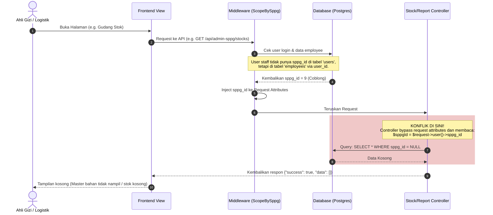
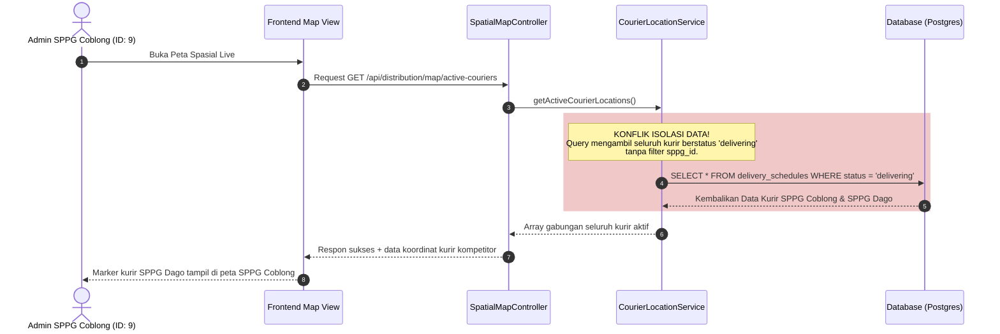

# Laporan Analisis Alur Kerja Detil, Konflik Logika, dan Berkas Bermasalah (Admin SPPG)

Dokumen ini merinci penelusuran alur kerja (step-by-step workflow tracing) sisi **Admin SPPG**, titik konflik variabel/database, berkas kode yang bermasalah beserta barisnya, serta visualisasi alur kegagalan sistem.

---

## 1. 🗺️ Penelusuran Alur Kerja & Titik Konflik (Step-by-Step Tracing)

### 🔑 Alur 1: Login & Resolusi Tenant ID (Staff vs Owner)

Alur ini menelusuri bagaimana sistem mengenali identitas SPPG dari pengguna yang masuk untuk membatasi akses data.



- **Titik Konflik Logika:**
    - `users.sppg_id` vs `employees.sppg_id`.
    - Middleware menyaring dengan benar menggunakan fallback `$user->sppg_id ?? $user->employee?->sppg_id` lalu menaruhnya di `$request->attributes`. Namun, controller-controller utama mengabaikan attribute ini dan langsung mengakses `$request->user()->sppg_id` yang bernilai `null` bagi karyawan non-owner.

---

### 🥗 Alur 2: Perencanaan Menu & Pengurangan Stok Gudang (FIFO)

Alur ini menjelaskan konflik data antara porsi kebutuhan sekolah mitra (untuk potong stok) dengan rencana distribusi fisik pengiriman.

```mermaid
flowchart TD
    A([Ahli Gizi menyusun Menu Mingguan]) --> B[Simpan Perencanaan]
    B --> C{Apakah ada tombol Publish di UI?}
    C -- Tidak ada --> D[UX BLOCK: Menu selamanya berstatus draft/planned\nStok gudang tidak pernah terpotong secara otomatis]

    C -- Ada backend endpoint --> E[Deduct Stock via FIFO]
    E --> F[Hitung total porsi:\nsum('portion_count') dari tabel 'partners']
    F --> G[Potong kuantitas di tabel 'stock_items']

    H([Admin Logistik membuat Jadwal Pengiriman]) --> I[Gunakan data sekolah dari tabel 'schools']
    I --> J[Tentukan porsi kirim:\nschools.student_count]

    rect rgb(255, 220, 220)
        F & J --> K{KONFLIK DATA INKONSISTEN:\nApakah partners.portion_count == schools.student_count?}
        K -- Tidak Sama --> L[ERROR: Jumlah stok bahan baku yang dipotong di gudang\ntidak sama dengan jumlah makanan fisik yang dimasak & didistribusikan!]
    end
```

- **Titik Konflik Logika:**
    - **Inkonsistensi Ganda Tabel Sekolah:** Tabel `schools` digunakan untuk pengiriman/distribusi harian, sedangkan tabel `partners` digunakan untuk perhitungan stok bahan resep mingguan.
    - Jika `schools.student_count` (misal 500 siswa) tidak sinkron dengan `partners.portion_count` (misal 450 porsi), maka sistem logistik akan memasak 500 porsi tetapi stok gudang hanya dipotong 450 porsi, menyebabkan selisih inventaris riil dengan digital.

---

### 🛵 Alur 3: Penugasan Kurir & Peta Spasial Live

Alur ini menjelaskan celah keamanan (data isolation bypass) yang menyebabkan bocornya lokasi kurir antar SPPG.



- **Titik Konflik Logika:**
    - Ketiadaan parameter `sppg_id` pada method `getActiveCourierLocations()`.
    - Setiap pengiriman (`delivery_schedules`) terhubung ke sekolah (`schools`) yang memiliki `sppg_id`. Karena service tidak memeriksa relasi `school.sppg_id`, data koordinat GPS kurir yang sedang berjalan bocor ke SPPG lain.

---

### 📥 Alur 4: Impor Sekolah Mitra dari File CSV

Alur ini menelusuri kegagalan pembacaan payload CSV dari frontend ke backend.

```mermaid
flowchart TD
    A([User upload file CSV di UI]) --> B[Frontend kirim Form-Data dengan field 'file']
    B --> C[Backend validation: ImportPartnerRequest]
    C --> C1{Cek parameter 'file'?}
    C1 -- Ada & valid --> D[Lolos Validasi]
    C1 -- Tidak ada --> D_ERR[Tolak 422: File is required]

    rect rgb(255, 220, 220)
        D --> E[PartnerController::import]
        E --> F[Ambil parameter: $request->input('records', [])]
        F --> G{KONFLIK PAYLOAD:\nApakah array 'records' ada?}
        G -- Kosong / Null --> H[Hasil: $records = []]
    end

    H --> I[Panggil PartnerService::importFromRows dengan array kosong]
    I --> J[Respon sukses: 'Berhasil mengimpor 0 partner']
    J --> K([UX FAIL: Sekolah mitra tidak bertambah ke database])
```

- **Titik Konflik Logika:**
    - Request Class memvalidasi parameter `'file'` (bertipe File), tetapi Controller mencoba memproses parameter `'records'` (bertipe Array) yang tidak dikirim oleh frontend.

---

## 2. 📂 Ringkasan Kesalahan Kode per Berkas (File-by-File Error Registry)

Berikut adalah daftar letak kesalahan kode program secara spesifik pada sistem Backend:

### 📄 1. [PartnerController.php](file:///d:/SEMESTER 6/ISB-310 SIWEB/TUBES/Backend/app/Http/Controllers/API/AdminSPPG/PartnerController.php#L111-L119)

- **Baris Bermasalah:** L113 - L116
- **Kode Saat Ini:**
    ```php
    $sppgId = $request->attributes->get('sppg_id');
    $records = $request->input('records', []);
    $result = $this->partnerService->importFromRows($sppgId, $records);
    ```
- **Kesalahan:** Mengabaikan file CSV fisik yang diunggah dan langsung mengambil input `records`. Rute ini diproteksi oleh `ImportPartnerRequest` yang memvalidasi `file` bertipe multipart, tetapi file tersebut tidak pernah disimpan atau di-parse di controller ini.
- **Perbaikan:** Ambil file lewat `$request->file('file')`, simpan sementara, lalu panggil `$this->partnerService->importFromFile($sppgId, $filePath)`.

### 📄 2. [MenuController.php](file:///d:/SEMESTER 6/ISB-310 SIWEB/TUBES/Backend/app/Http/Controllers/API/AdminSPPG/MenuController.php#L179-L188)

- **Baris Bermasalah:** L182
- **Kode Saat Ini:**
    ```php
    $updated = $this->menuService->refreshAllStatuses();
    ```
- **Kesalahan:** Memanggil method `refreshAllStatuses()` pada `MenuService`. Namun, di dalam kelas `MenuService`, method tersebut **tidak ada** (hanya ada `refreshStatus(Menu $menu)`). Hal ini memicu `BadMethodCallException` (Error 500) saat dipanggil.
- **Perbaikan:** Tulis implementasi method `refreshAllStatuses()` di [MenuService.php](file:///d:/SEMESTER 6/ISB-310 SIWEB/TUBES/Backend/app/Services/SPPG/MenuService.php) untuk mengupdate status menu-menu draf secara massal sesuai tanggal berjalan.

### 📄 3. [CourierLocationService.php](file:///d:/SEMESTER 6/ISB-310 SIWEB/TUBES/Backend/app/Services/Distribution/CourierLocationService.php#L47-L80)

- **Baris Bermasalah:** L49 - L55
- **Kode Saat Ini:**
    ```php
    $activeSchedules = DeliverySchedule::where('status', DeliverySchedule::STATUS_DELIVERING)
        ->with(['latestLocation', 'courier:id,name', 'school:id,name,latitude,longitude'])
        ->get();
    ```
- **Kesalahan:** Mengambil seluruh jadwal aktif berstatus `delivering` dari database tanpa memfilter berdasarkan `sppg_id` sekolah mitra. Menyebabkan kebocoran koordinat kurir antar SPPG.
- **Perbaikan:** Tambahkan parameter `int $sppgId` ke method, lalu tambahkan scope filter:
    ```php
    $activeSchedules = DeliverySchedule::where('status', DeliverySchedule::STATUS_DELIVERING)
        ->whereHas('school', fn($q) => $q->where('sppg_id', $sppgId))
        ->with([...])->get();
    ```

### 📄 4. [SpatialMapController.php](file:///d:/SEMESTER 6/ISB-310 SIWEB/TUBES/Backend/app/Http/Controllers/API/Distribution/SpatialMapController.php#L131-L143)

- **Baris Bermasalah:** L138 - L140
- **Kode Saat Ini:**
    ```php
    'latitude'  => config('distribution.depot_lat'),
    'longitude' => config('distribution.depot_lng'),
    ```
- **Kesalahan:** Lokasi titik awal (depot dapur) mengambil dari konfigurasi file `.env` secara global. Hal ini membuat semua SPPG (Coblong, Dago, dll) memiliki titik awal rute yang sama di peta, merusak perhitungan optimasi rute AI lokal.
- **Perbaikan:** Ambil koordinat dynamic dari database relasi SPPG pengguna:
    ```php
    $sppg = \App\Models\SPPG::findOrFail($sppgId);
    return response()->json([
        'data' => [
            'name' => $sppg->name,
            'latitude' => $sppg->latitude,
            'longitude' => $sppg->longitude
        ]
    ]);
    ```

### 📄 5. [StockController.php](file:///d:/SEMESTER 6/ISB-310 SIWEB/TUBES/Backend/app/Http/Controllers/API/AdminSPPG/StockController.php) (Tersebar)

- **Baris Bermasalah:** L40, L55, L102, L141, L189, L213, L232, L305, L332, L356, L382, L408
- **Kode Saat Ini:**
    ```php
    $sppgId = $request->user()->sppg_id;
    ```
- **Kesalahan:** Menggunakan `$request->user()->sppg_id` secara langsung. Nilai ini bernilai `null` bagi akun Karyawan (Ahli Gizi/Admin Logistik) karena data `sppg_id` mereka berada di tabel `employees`.
- **Perbaikan:** Ubah menjadi `$sppgId = $request->attributes->get('sppg_id');` di setiap method untuk mengambil value yang sudah di-resolve oleh middleware.

### 📄 6. [DeliveryScheduleController.php](file:///d:/SEMESTER 6/ISB-310 SIWEB/TUBES/Backend/app/Http/Controllers/API/Distribution/DeliveryScheduleController.php)

- **Baris Bermasalah:** L38 - L75 (Index) & L79 - L87 (Show)
- **Kesalahan:** Tidak menyaring data berdasarkan `sppg_id` SPPG yang login, melainkan langsung mengambil `DeliverySchedule::active()` secara global.
- **Perbaikan:** Saring query menggunakan `whereHas('school', fn($q) => $q->where('sppg_id', $sppgId))`.

### 📄 7. [StoreDeliveryScheduleRequest.php](file:///d:/SEMESTER 6/ISB-310 SIWEB/TUBES/Backend/app/Http/Requests/Distribution/StoreDeliveryScheduleRequest.php#L19-L29)

- **Baris Bermasalah:** L22 - L23
- **Kode Saat Ini:**
    ```php
    'courier_id' => ['required', 'integer', 'exists:employees,id'],
    'school_id'  => ['required', 'integer', 'exists:schools,id'],
    ```
- **Kesalahan:** Membiarkan admin menunjuk kurir (`courier_id`) atau sekolah (`school_id`) mana saja di database secara bebas, tanpa divalidasi apakah kurir/sekolah tersebut di bawah naungan SPPG yang sama dengan admin yang membuat jadwal.
- **Perbaikan:** Batasi validasi exists menggunakan scope `sppg_id`:
    ```php
    Rule::exists('employees', 'id')->where('sppg_id', $sppgId)
    Rule::exists('schools', 'id')->where('sppg_id', $sppgId)
    ```

### 📄 8. [2026_05_12_160000_create_partners_table.php](file:///d:/SEMESTER 6/ISB-310 SIWEB/TUBES/Backend/database/migrations/2026_05_12_160000_create_partners_table.php#L14)

- **Baris Bermasalah:** L14
- **Kode Saat Ini:**
    ```php
    $table->string('npsn')->nullable()->unique();
    ```
- **Kesalahan:** Kolom `npsn` diset sebagai `unique()` secara global di level database Postgres. Jika SPPG A melayani sekolah X dengan NPSN 123, maka SPPG B tidak akan pernah bisa melayani atau mendaftarkan sekolah tersebut karena database akan menolak duplikasi.
- **Perbaikan:** Ubah unique constraint menjadi composite unique key:
    ```php
    $table->unique(['sppg_id', 'npsn']);
    ```
